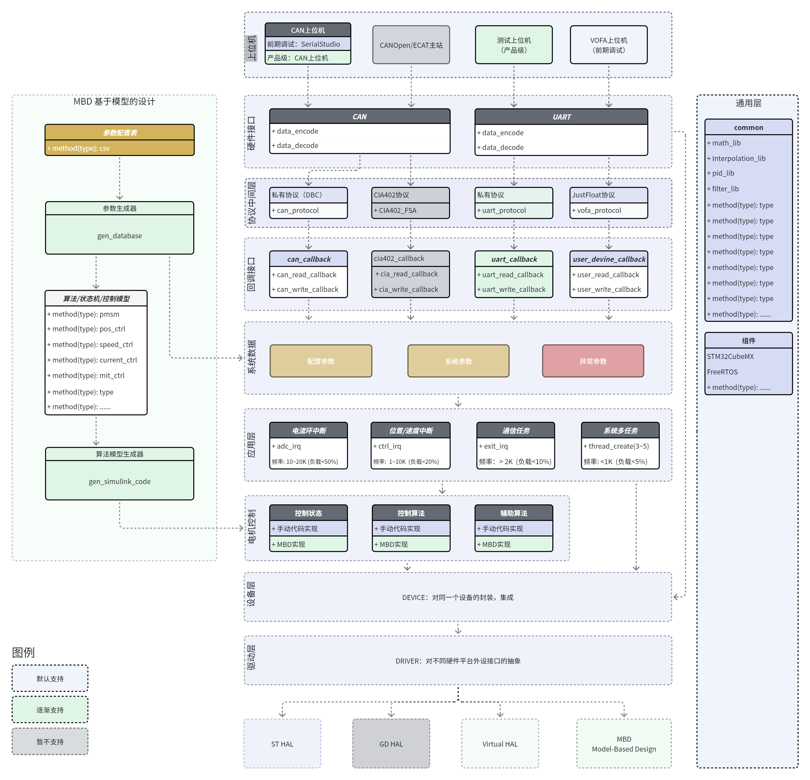
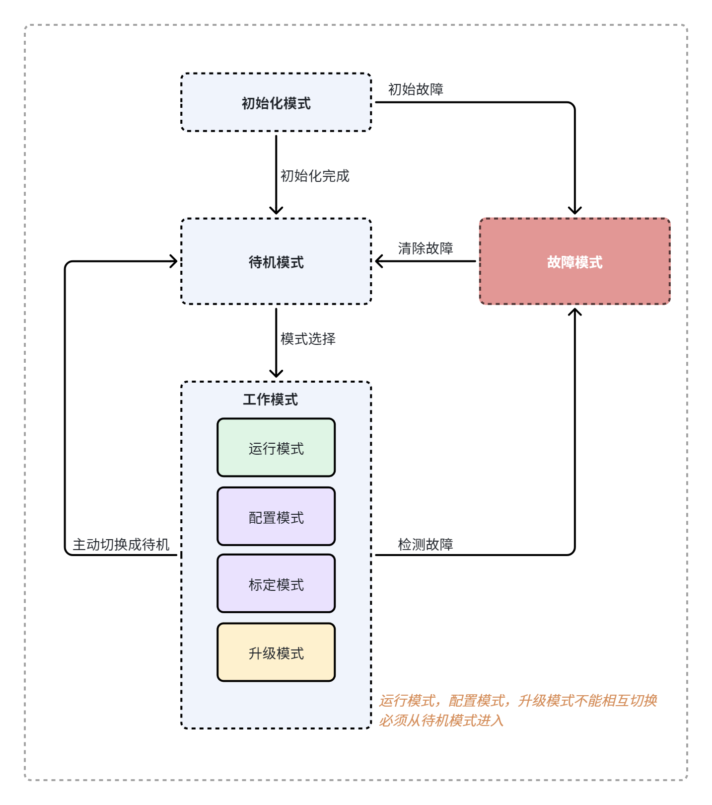
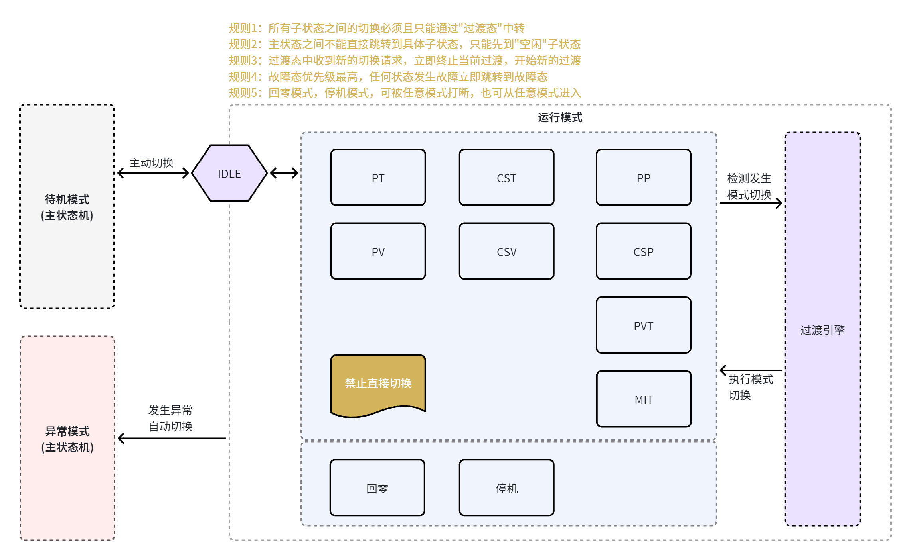
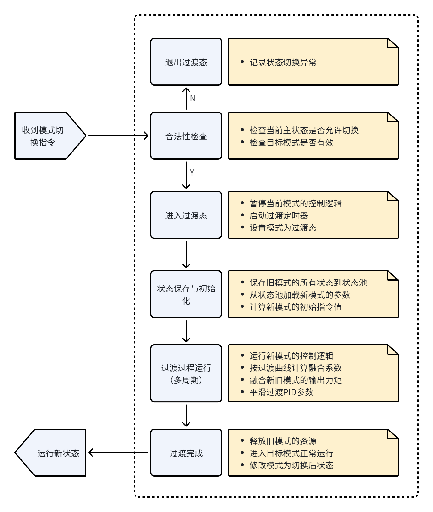

# JointMotor

基于 STM32G474 的关节电机控制器固件仓库，包含主控板固件、参考板工程、协议文档、参数生成工具，以及配套的 PyQt 上位机与虚拟电机调试工具。项目采用分层架构，支持双板级（V1 / SFOC）编译期切换、真实硬件与虚拟电机在环仿真两种模式切换。

## 仓库概览

当前仓库不仅包含 MCU 固件，还同时维护了通信协议、参数表生成流程、电机标定体系与 PC 端调试工具：

- **主固件工程**：`Board/V1`，目标芯片为 `STM32G474CETx`
- **参考板工程**：`Board/SFOC`（以 git 子模块管理），同样具备完整 CubeMX / HAL / Keil 工程
- **用户代码主体**：`User/`，承载控制、算法、设备抽象、协议实现与标定体系
- **上位机工具**：`User/Tools/pyqt_gui`（以子模块形式维护）
- **协议文档与表格**：`User/Protocol/docs`
- **参数生成工具**：`User/Tools/motor_param_gen`、`User/Tools/motor_info_gen`

## 硬件平台

| 项目 | 规格 |
| --- | --- |
| MCU | STM32G474CETx（Cortex-M4F，带 FPU / DSP） |
| 主频 | 170 MHz |
| Flash / RAM | 512 KB / 128 KB |
| 编码器 | MT6701（14 bit）/ MT6835（21 bit）磁编码器 |
| 功率级 | 三相半桥，互补 PWM + ADC 注入同步采样 |
| 通信 | FDCAN、USART |

## 软件环境

- **IDE / 工具链**：Keil MDK-ARM
  - 主工程：`Board/V1/MDK-ARM/JointMotorApp.uvprojx`
  - 参考板：`Board/SFOC/MDK-ARM/sfoc.uvprojx`
- **Keil Pack**：`Keil.STM32G4xx_DFP.2.2.0`
- **编译器**：Arm Compiler 5（工程当前配置）
- **配置工具**：STM32CubeMX（`Board/V1/JointMotorApp.ioc`、`Board/SFOC/sfoc.ioc`）
- **RTOS**：FreeRTOS（CMSIS-OS V1）
- **代码格式**：项目根目录 `.clang-format`

## 核心特性

- **FOC 电流环**：Clarke / Park / 反 Park / SVPWM，面向 M4F 单精度优化
- **级联控制结构**：位置环、速度环、电流环分层组织，统一中断入口分频执行
- **模式化控制**：12 种运动模式一模式一文件（IDLE/HOLD/OPEN_LOOP/DUTY/CURRENT/TORQUE/MIT/VELOCITY/POSITION/PV/PT/TEST_SWEEP），由 `motor_control.c` 模式分发表查表派发
- **电机标定体系**：7 级 27 子模式独立模块，含 `calib_mgr` 调度器、`calib_hw` 硬件会话层、`calib_config.h` 集中可调参数；标定结果经 `calib_validate_*` 校验后写入 `motor_param`
- **虚拟电机在环仿真**：dq 物理模型复用真实 FOC 算法，无需硬件即可闭环验证
- **多圈位置解算**：运动参数与绝对多圈计数解耦
- **协议双通道**：统一命令空间，同时覆盖串口与 CAN（`joint_proto`），并兼容 VESC Tool（`vesc_proto`）
- **双板级支持**：`board_select.h` 编译期二选一（V1 / SFOC），板级设备映射表隔离
- **电机型号档案**：`motor_profile.h` 作为唯一真相源，切换型号仅改一处宏
- **参数表代码生成**：CSV 自动生成 `motor_param.c/h` 与 `motor_info.c/h` 访问层
- **MotorInfo 持久化**：1024B Flash 整块布局（6 子块），含校验与整块读写
- **调试工具完善**：配套 JM Studio 上位机、独立数字孪生工具、独立波形采集工具

## 系统架构与状态机

### 软件框图

整体软件分层架构自顶向下为：用户入口层 -> 系统服务层 -> 控制业务层（含标定模块）-> 算法层 -> 设备抽象层 -> 驱动层，底层由 FreeRTOS 任务调度支撑。



### 主状态机

系统顶层状态机定义见 `User/DataHub/state_define.h` 中的 `top_fsm_e`。系统从 `INIT` 进入 `IDLE`，经使能进入 `READY` 与 `RUN`；另包含 `CALIB`、`CONFIG`、`BOOTLOADER` 等工作态，以及最高优先级的 `SAFETY` 与 `FAULT`。



### 运行模式状态机

运行态子模式定义见 `run_state_e` / `ctrl_mode_e`，覆盖开环、电流、力矩、速度、位置、MIT、PV / PT、扫频等模式，由协议命令驱动切换。



### 过渡模式

模式切换过渡逻辑位于 `User/MotorControl/ControlProcess/ctrl_transition.c/h`。切换前先做合法性检查，合法则进入过渡态执行状态保存、初始化与平滑过渡，完成后切入目标模式；非法切换则维持原状态。



## 目录结构

```text
JointMotor/
├── Board/
│   ├── V1/                         # 主控板工程：CubeMX、HAL、FreeRTOS、Keil 工程
│   │   ├── Core/                   # CubeMX 生成：main / 外设初始化 / IT
│   │   ├── Drivers/                # CMSIS / STM32G4xx HAL
│   │   ├── Middlewares/            # FreeRTOS / ARM DSP
│   │   ├── Config/                 # 板级设备映射：dev_config_board.h/.inc
│   │   ├── MDK-ARM/                # JointMotorApp.uvprojx
│   │   └── JointMotorApp.ioc
│   └── SFOC/                       # 参考板工程（git 子模块）
│       ├── Core/ Drivers/ Middlewares/
│       ├── Config/
│       ├── MDK-ARM/                # sfoc.uvprojx
│       └── sfoc.ioc
├── User/                           # 用户代码主体
│   ├── AppEntry/                   # 入口层：初始化、调度、中断转发
│   ├── AppServices/                # 系统服务：状态机、线程管理、上位机通信接入
│   │   ├── StateMachine/
│   │   ├── ThreadManager/
│   │   └── ParamService/           # jm_host_commun / serialstudio_commun
│   ├── Common/                     # 通用工具：PID、CRC16、CRC32C、断言、VOFA
│   ├── Config/                     # 编译期配置：system/control/protocol/debug_config
│   │                               # + motor_profile（电机型号档案）+ board_select（板级选择器）
│   ├── Data/                       # 图片、PDF、计划文档
│   ├── DataHub/                    # 全局数据中心：motor_param / motor_info / runtime / state_define / version
│   ├── Devices/                    # 设备抽象：电机、编码器、半桥、采样、电源监控、通信设备
│   ├── Driver/                     # HAL 之上的驱动封装
│   ├── MotorAlgorithms/            # 纯算法：FOC、运动解算、多圈计数
│   ├── MotorCalibration/           # 电机标定：calib_mgr + 7 级模块 + calib_hw + calib_config
│   ├── MotorControl/               # 控制业务
│   │   ├── CascadeControl/         # 三环级联 + 虚拟电机
│   │   ├── ControlProcess/        # 控制流程 + 过渡引擎 + 模式分发表
│   │   └── Modes/                  # 12 种模式一模式一文件
│   ├── Protocol/                   # joint_proto / vesc_proto / packer_parser / serial_studio
│   ├── Tools/
│   │   ├── motor_param_gen/        # motor_param.c/h 代码生成器
│   │   ├── motor_info_gen/         # motor_info.c/h 代码生成器
│   │   └── pyqt_gui/               # JM Studio 上位机（子模块）
│   └── User文件结构说明.md         # User 层详细职责说明
├── README.md
├── buildclean.bat                  # 清理 Keil 编译中间产物
├── .clang-format
├── .gitignore
└── .gitmodules
```

`User/` 各模块的详细职责与文件清单见 [User/User文件结构说明.md](User/User文件结构说明.md)。板级目录管理规则见 [Board/README.md](Board/README.md)。

## 克隆仓库

本仓库包含子模块，首次拉取请使用递归方式：

```bash
git clone --recursive <repo-url>
```

如果已经完成普通克隆，请执行：

```bash
git submodule update --init --recursive
```

当前子模块包括：

- `Board/SFOC`
- `User/Tools/pyqt_gui`

## 板级切换

通过 `User/Config/board_select.h` 实现编译期板级二选一：

| Keil 目标宏 | 板级工程 | 引入配置 |
| --- | --- | --- |
| `JM_BOARD_V1` | `Board/V1` | `Board/V1/Config/dev_config_board.h` |
| `JM_BOARD_SFOC` | `Board/SFOC` | `Board/SFOC/Config/dev_config_board.h` |

切换方式：

1. 在 Keil 工程的「目标选项 -> C/C++ -> Define」中设置板宏（如 `JM_BOARD_V1`）
2. `board_select.h` 自动引入对应板级的 `dev_config_board.h`（板级设备使能宏 `USE_DEV_XXX`）与 `dev_config_board.inc`（硬件资源映射表）
3. 重新编译工程

板级参数（PWM 频率 / 编码器线数 / 死区时间 / 引脚映射）与电机电气身份参数（`motor_profile.h`）分离，互不影响。新增板级流程见 [Board/README.md](Board/README.md)。

## 电机型号档案

`User/Config/motor_profile.h` 是电机电气身份参数的**唯一真相源**，集中存放各型号的 R / Ld / Lq / flux / 极对数 / KT / KE / 额定电流等。三个消费方通过 `#include` 引用：

- `User/DataHub/motor_param.c`（控制环运行时默认值）
- `User/DataHub/motor_info.c`（协议持久化参数默认值）
- `User/MotorCalibration/calib_config.h`（标定结果合理性范围）

切换电机型号：修改 `MOTOR_PROFILE` 宏为对应型号编号即可，新增型号追加 `#elif` 分支填写参数。

## 真实电机 / 虚拟电机切换

设备接入层采用编译期二选一，对上层保持统一的 `dev_motor_*` 接口：

| 宏 `MOTOR_LOOP_ENABLE_DEV_DRIVER` | 编译实现 | 用途 |
| --- | --- | --- |
| `1` | `User/Devices/dev_motor.c` | 真实硬件运行 |
| `0` | `User/MotorControl/CascadeControl/dev_motor_virtual.c` | 虚拟电机在环仿真 |

切换方式：

1. 打开 `User/MotorControl/CascadeControl/motor_loop_config.h`
2. 修改 `MOTOR_LOOP_ENABLE_DEV_DRIVER`
3. 重新编译工程

默认配置为：

```c
#define MOTOR_LOOP_ENABLE_DEV_DRIVER 1u
```

虚拟电机实现复用真实 `foc_core.c` 的 FOC 数学逻辑，从而保证仿真与实机尽量运行同一套控制算法。

## 电机标定系统

`User/MotorCalibration/` 提供独立的电机参数标定体系，与 `MotorControl/` 解耦，由主状态机的 `CALIB` 态触发。

### 级别划分（7 级 27 子模式）

| 级别 | 模块 | 子模式数 | 内容 |
| --- | --- | --- | --- |
| L1 | `calib_level1_driver.c` | 6 | 驱动硬件底层（ADC 偏置/增益/电流传感器/温度/母线电压/死区） |
| L2 | `calib_level2_motor.c` | 6 | 电机电气身份（相序/极对数/R/Ld/Lq/flux） |
| L3 | `calib_level3_encoder.c` | 5 | 编码器校准（零位/方向/线性度/正余弦/多圈零点） |
| L4 | `calib_level4_torque.c` | 1 | 转矩基础（力矩常数 KT） |
| L5 | `calib_level5_nonlinear.c` | 4 | 非线性补偿（齿槽/摩擦/死区/磁饱和） |
| L6 | `calib_level6_system.c` | 4 | 负载系统级（惯量/阻尼/回程间隙/PID 自整定） |
| L7 | `calib_level7_auto.c` | 1 | 全自动序列（16 步：L2 段按 R→Ld→Lq→flux 顺序） |

### 核心组件

- `calib_mgr.c/h`：标定管理器，注入 `dev_motor`/`motor_param`/`dt`，提供 `start`/`poll`/`abort`/`get_status`；维护 `done_mask`（uint64 位图）记录各级子模式完成状态，支持前置依赖检查
- `calib_hw.c/h`：标定共享硬件访问层，封装 `calib_hw_session_t` 会话（保存/恢复电角度回调 + 强制电角度），提供 `enter`/`exit`/`apply_voltage`/`apply_zero`/`get_encoder_*`；所有 level 模块复用此层
- `calib_config.h`：标定可调参数集中配置，所有电压/时间/采样数从 `motor_profile.h` 派生（测试电流 = 峰值电流×0.14，时间参数由 `MOTOR_TAU_S=Ld/R` 派生），切换电机型号自动适配
- `calib_types.h`：状态枚举 / 失败原因码 / 级别与子模式常量 / `calib_level_ops_t` ops 函数表 / 前置依赖表 `s_calib_dep_table`
- `calib_validate.h`：标定结果合理性校验工具，结果写入 `motor_param` 前调用

每个 level 模块导出一个 `const calib_level_ops_t` 实例，`calib_mgr` 按 level 索引查表调用 `start`/`poll`/`abort`；模块内文件静态全局变量收敛到单个 `s_lN` 结构体（如 `s_l2`、`s_l3`）。

## 编译与烧录

### 固件构建

1. 使用 Keil MDK-ARM 打开对应板级工程：
   - V1 主板：`Board/V1/MDK-ARM/JointMotorApp.uvprojx`
   - SFOC 参考板：`Board/SFOC/MDK-ARM/sfoc.uvprojx`
2. 确认目标选项中已定义正确的板级宏（`JM_BOARD_V1` 或 `JM_BOARD_SFOC`）
3. 执行编译
4. 通过 ST-Link 或 J-Link 下载到目标板

### CubeMX 重新生成

当外设配置需要调整时：

1. 打开对应板级的 `.ioc`（`Board/V1/JointMotorApp.ioc` 或 `Board/SFOC/sfoc.ioc`）
2. 在 STM32CubeMX 中修改外设
3. 重新生成代码
4. 回到 Keil 工程重新编译

`Board/<板名>/Core`、`Drivers`、`Middlewares` 为 CubeMX / HAL 生成内容，用户业务代码主要位于 `User/`。

### 清理中间文件

在仓库根目录运行：

```bat
buildclean.bat
```

该脚本会清理 `Board/V1/MDK-ARM` 下的 `Objects`、`Listings`、`DebugConfig`、输出目录及若干临时文件。

## 通信协议

协议实现与文档位于 `User/Protocol/`：

- `docs/joint_motor_protocol_spec.md`：协议规范说明
- `docs/joint_motor_command_list.csv`：命令总表（100 条）
- `docs/joint_motor_param_index.csv`：参数索引表（83 个）
- `joint_proto/`：自研协议核心实现与串口 / CAN 封装（传输无关，业务经 `jm_proto_ops_t` 回调注入）
- `packer_parser/`：串口打包与解析器
- `serial_studio/`：Serial Studio 工具链与配置生成脚本
- `vesc_proto/`：VESC 兼容协议（平台无关、可多实例，可伪装成 VESC 从机）

协议命令空间统一覆盖串口与 CAN，便于固件、上位机与调试工具共享同一套命令定义。串口帧采用 STX + LEN + 头校验 + CMD/DATA + CRC16 格式，多字节数值小端编码，浮点为 IEEE-754 `f32`。

## 参数表生成

参数访问层由 CSV 自动生成，共两套生成器：

### motor_param（控制参数）

位于 `User/Tools/motor_param_gen/`：

```bash
cd User/Tools/motor_param_gen
python motor_param_generate_v9.py
```

编辑 `motor_param.csv` 后重新执行脚本，将生成：

- `User/DataHub/motor_param.c`
- `User/DataHub/motor_param.h`

生成结果包含参数 get / set 接口、只读字段保护、数组字符串接口、边界校验，并按 `.clang-format` 格式化。

### motor_info（持久化配置参数）

位于 `User/Tools/motor_info_gen/`：

```bash
cd User/Tools/motor_info_gen
python motor_info_generate.py
```

编辑 `motor_info.csv` 后重新执行脚本，将生成：

- `User/DataHub/motor_info.c`
- `User/DataHub/motor_info.h`

生成结果为 1024B Flash 整块布局（6 子块：SystemParam / MotorCalibParam / DeviceParam / ControlParam / ProtectCommParam / AdvancedAlgoParam），含整块 memcpy 读写、字段偏移常量、越界校验。详见 [User/Tools/motor_info_gen/MotorInfo_readme.md](User/Tools/motor_info_gen/MotorInfo_readme.md)。

## PyQt 上位机

配套上位机 **JM Studio** 位于 `User/Tools/pyqt_gui/`，用于串口 / CAN / 虚拟孪生调试。

主要能力包括：

- 协议/传输解耦：`jmproto` 零硬件依赖，`transport` 抽象基类可插拔串口 / CAN / 虚拟引擎
- 数据驱动 UI：100 命令 + 83 参数由 CSV 渲染，新增协议项无需改 Python 代码
- 数字孪生引擎：dq 电气方程 + 机械方程 + 热模型 + 关节负载 + FOC + 状态机
- 遥测订阅：10 通道按位掩码，单帧多通道上报
- 完整诊断：实时反馈 + 状态机 + 故障历史 + NACK 中文解码
- 附属工具：独立数字孪生上位机、独立波形采集上位机（带 FFT / 触发 / 导出）

快速启动：

```bash
cd User/Tools/pyqt_gui
pip install -r requirements.txt
python main.py
```

当前主要 Python 依赖：

- `PyQt6`
- `pyserial`
- `pyqtgraph`
- `numpy`

更详细说明见 [User/Tools/pyqt_gui/README.md](User/Tools/pyqt_gui/README.md)。

## 相关文档

- [User/User文件结构说明.md](User/User文件结构说明.md)：User 层目录详细职责与文件清单
- [Board/README.md](Board/README.md)：板级目录结构与新增板级流程
- [User/Protocol/docs/joint_motor_protocol_spec.md](User/Protocol/docs/joint_motor_protocol_spec.md)：通信协议规范
- [User/Protocol/docs/joint_motor_command_list.csv](User/Protocol/docs/joint_motor_command_list.csv)：命令总表
- [User/Protocol/docs/joint_motor_param_index.csv](User/Protocol/docs/joint_motor_param_index.csv)：参数索引表
- [User/Tools/pyqt_gui/README.md](User/Tools/pyqt_gui/README.md)：JM Studio 上位机说明
- [User/Tools/motor_info_gen/MotorInfo_readme.md](User/Tools/motor_info_gen/MotorInfo_readme.md)：MotorInfo Flash 布局说明
- [User/AppServices/StateMachine/system_state_fsm.md](User/AppServices/StateMachine/system_state_fsm.md)：主状态机说明
- [User/MotorCalibration/docs/标定状态机说明.md](User/MotorCalibration/docs/标定状态机说明.md)：标定状态机说明
- [User/Protocol/vesc_proto/README.md](User/Protocol/vesc_proto/README.md)：VESC 协议移植说明
