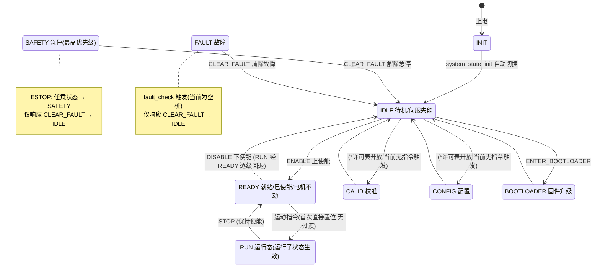
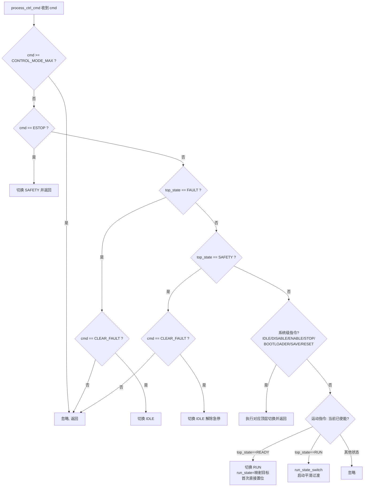
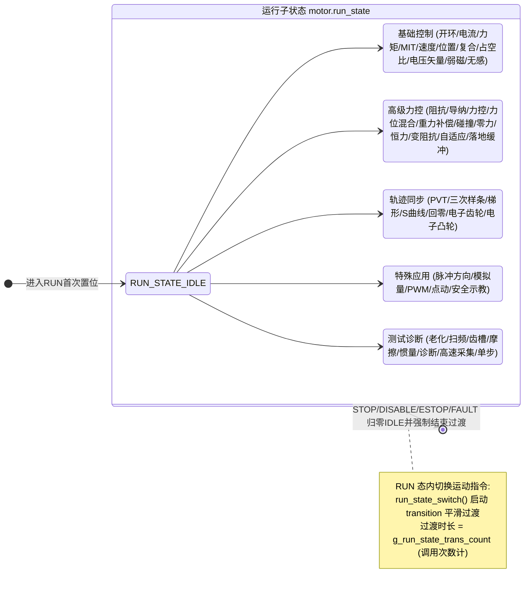
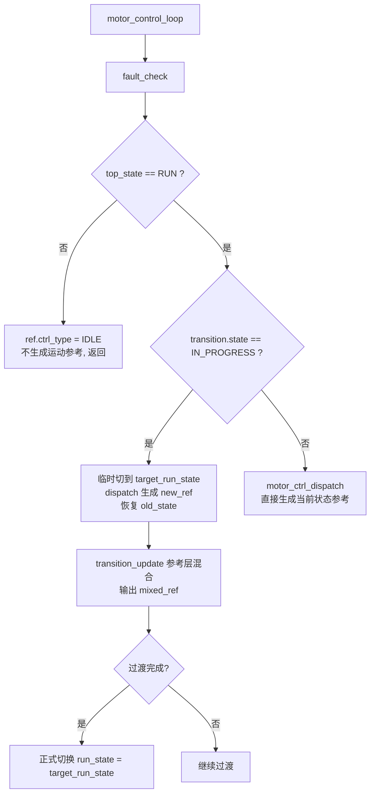
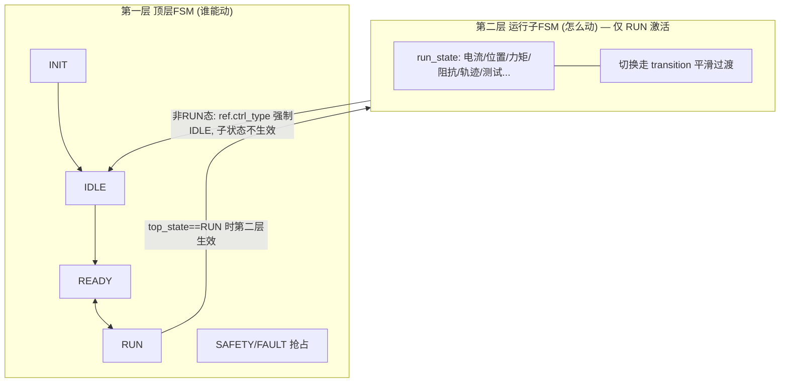

# 系统状态机逻辑图

> 对应实现：`system_state.c` / `system_state.h` / `state_define.h` / `ctrl_transition.h`
> 本文档采用 Mermaid 语法，可在支持 Mermaid 的编辑器（VSCode + Markdown Preview Mermaid Support 插件、GitHub、Typora 等）中直接渲染。

---

## 1. 第一层：顶层主状态机 (top_fsm_e)

第一层决定「系统处于什么阶段、伺服是否使能」。FAULT / SAFETY 为抢占式状态，可从任意状态进入（不查许可表）。

### 1.1 转移许可表 `s_top_fsm_allowed[from][to]`

| From \ To | INIT | IDLE | READY | RUN | CALIB | CONFIG | BOOT |
|-----------|:----:|:----:|:-----:|:---:|:-----:|:------:|:----:|
| INIT      |      |  ✓   |       |     |       |        |      |
| IDLE      |      |      |  ✓    |     |  ✓    |   ✓    |  ✓   |
| READY     |      |  ✓   |       |  ✓  |       |        |      |
| RUN       |      |      |  ✓    |     |       |        |      |
| FAULT     |      |  ✓   |       |     |       |        |      |
| SAFETY    |      |  ✓   |       |     |       |        |      |
| CALIB     |      |  ✓   |       |     |       |        |      |
| CONFIG    |      |  ✓   |       |     |       |        |      |
| BOOT      |      |  ✓   |       |     |       |        |      |

> - FAULT / SAFETY 不在表中：由 `top_fsm_transition_allowed()` 单独放行，任意状态可进入。
> - `(*)` IDLE→CALIB / IDLE→CONFIG 在许可表中开放，但 `process_ctrl_cmd()` 当前没有指令会触发进入这两个状态。

---

## 2. 指令处理优先级 (process_ctrl_cmd)

控制指令按固定优先级处理，急停最高。

---

## 3. 第二层：运行子状态机 (run_state_e) — 仅 RUN 态内有效

第二层决定「使能后电机用哪种控制律运动」。仅当 `top_state == TOP_FSM_RUN` 时由 `motor_control_loop()` 执行。

### 3.1 控制指令 → 运行子状态映射 `s_ctrl_mode_to_run_state`

| 控制指令 (ctrl_mode_e)        | 运行子状态 (run_state_e)        |
|-------------------------------|---------------------------------|
| IDLE / HOLD / BRAKE           | RUN_STATE_IDLE                  |
| OPEN_LOOP                     | RUN_STATE_OPEN_LOOP             |
| CURRENT                       | RUN_STATE_CURRENT               |
| TORQUE                        | RUN_STATE_TORQUE                |
| MIT                           | RUN_STATE_MIT                   |
| VELOCITY                      | RUN_STATE_VELOCITY              |
| POSITION                      | RUN_STATE_POSITION              |
| POSITION_VELOCITY             | RUN_STATE_POSITION_VELOCITY     |
| POSITION_TORQUE               | RUN_STATE_POSITION_TORQUE       |
| VELOCITY_TORQUE               | RUN_STATE_VELOCITY_TORQUE       |
| DUTY_CYCLE                    | RUN_STATE_DUTY_CYCLE            |
| VOLTAGE_VECTOR                | RUN_STATE_VOLTAGE_VECTOR        |
| FIELD_WEAKENING               | RUN_STATE_FIELD_WEAKENING       |
| SENSORLESS                    | RUN_STATE_SENSORLESS            |
| IMPEDANCE ~ LANDING_BUFFER    | 对应 RUN_STATE_* (高级力控)      |
| PVT ~ ELECTRONIC_CAM          | 对应 RUN_STATE_* (轨迹同步)      |
| STEP_DIR ~ SAFE_TEACH         | 对应 RUN_STATE_* (特殊应用)      |
| TEST_* / DIAGNOSTIC / DAQ ... | 对应 RUN_STATE_* (测试诊断)      |

> **映射缺口（复核注意）**：`CANOPEN_SYNC`、`ETHERCAT_CSP/CSV/CST`、`PP/PV/PT`、`TEST_CURRENT_LOOP`、`TEST_VELOCITY_LOOP` 在 `ctrl_mode_e` 中已定义，但映射表中未配置，默认值为 0 → `RUN_STATE_IDLE`，会出现「进 RUN 但电机不动」的静默退化。

---

## 4. 平滑过渡机制 (ctrl_transition)

`motor_control_loop()` 在 RUN 态处理运动模式切换的平滑过渡。

**过渡两种语义（由 `ctrl_type` 量纲决定）：**

- **同 `ctrl_type`（量纲一致）**：对目标参考值做线性混合，输出连续无跳变。
- **异 `ctrl_type`（量纲不同）**：不混合，直接切到新参考，由下游三环检测 `ctrl_type` 变化后预装载积分实现无扰切换。

---

## 5. 两层关系总览

---

## 6. 复核备注（实现与文档差异）

| 编号 | 问题 | 位置 | 影响 |
|:----:|------|------|------|
| ① | CALIB / CONFIG 顶层态无指令可进入 | `process_ctrl_cmd` | 校准/配置功能进不去 |
| ② | 部分已定义指令未配映射表，静默退化为 IDLE | `s_ctrl_mode_to_run_state` | 进RUN但不动，无拒绝反馈 |
| ③ | HOLD / BRAKE 映射到 RUN_STATE_IDLE，会推进 RUN 态 | 映射表 | 语义需确认 |
| ④ | `fault_check` 为空桩，无自动故障检测 | `fault_check` | 与头文件注释不符 |
| ⑤ | 文件头注释 FAULT/SAFETY 顺序与枚举(SAFETY先)不一致 | `system_state.c:4` | 仅文档误导，功能无影响 |
