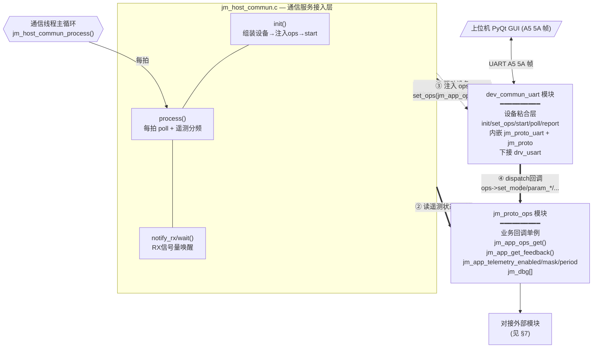
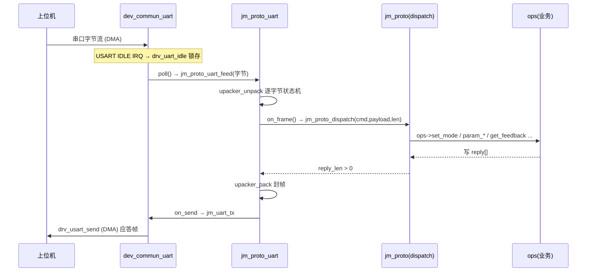
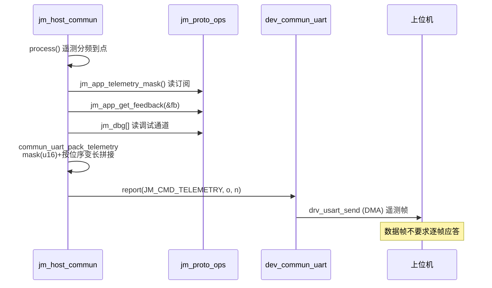
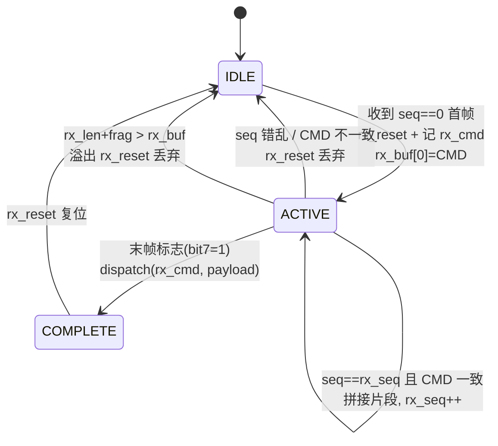
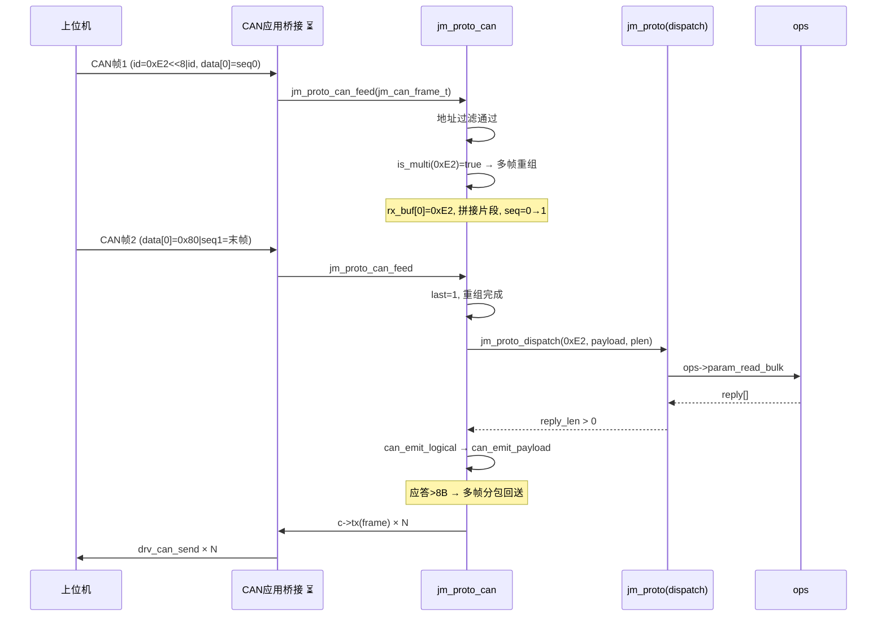

# 关节电机协议(joint_proto)架构与数据通路详图

> 本文档以 Mermaid 描述 `joint_proto` 协议栈的分层架构、UART/CAN 双传输通路的完整
> 数据流、帧格式与字节级布局。建议与 `joint_motor_protocol_spec.md`(协议规范)、
> `joint_motor_command_list.csv`(命令清单)配合参阅。
>
> **渲染**:VS Code / Trae 安装 "Markdown Preview Mermaid Support" 插件,或推送至
> GitHub 均可直接渲染为图形。

---

## 目录

- [术语表](#术语表)
- [1. 协议四层架构总览](#1-协议四层架构总览)
- [2. UART 通路: 通信服务接入层与设备粘合层](#2-uart-通路)
- [3. UART 帧格式与收发时序](#3-uart-帧格式与收发时序)
- [4. CAN 通路: 绑定层完整数据通路](#4-can-通路)
- [5. CAN 帧格式与字节级布局](#5-can-帧格式)
- [6. CAN 收发时序图](#6-can-收发时序图)
- [7. 业务回调层: jm_proto_ops 对接外部模块](#7-业务回调层)
- [8. UART 与 CAN 对照表](#8-uart-与-can-对照表)
- [9. 应用侧桥接实现现状](#9-应用侧桥接实现现状)
- [10. 文件清单与解耦边界](#10-文件清单与解耦边界)

---

## 术语表

> 本文使用的协议术语统一定义如下,全文据此保持一致。

| 术语 | 英文 | 释义 |
|------|------|------|
| 命令码 | Command Code | 协议中标识操作的 8 位数值,范围 `0x00`~`0xFE`,定义于 `jm_cmd_def.h` |
| 载荷 | Payload | 命令携带的数据体,统一采用小端字节序(Little-Endian) |
| 应答 | Reply | 电机对命令的返回;协议实例 `reply[]` 中 `reply[0]` 恒为命令码 |
| 上位机 | Host | 发出命令的控制端,泛指 PC 上位机或运动主控,协议层不区分其物理形态 |
| 仲裁 ID | Arbitration ID | CAN 帧标识,`JM_CAN_MAKE_ID(cmd,motor_id) = (cmd<<8) | motor_id` |
| 多帧分段 | Segmentation | CAN 上大于 8B 的载荷拆为多帧传输,每帧 7B 载荷 + 1B 控制字 |
| 重组 | Reassembly | 接收方按序号拼接多帧还原完整载荷 |
| 归一化 | Normalization | CAN 的 MIT 8B 压缩帧在 dispatch 前解压为 5×f32,使两传输载荷一致 |
| 定点压缩 | Fixed-point Quantization | float 按给定范围线性映射到 N 位无符号整数 |
| 绑定层 | Binding Layer | 传输介质相关的协议编解码层(L2),即 `jm_proto_uart` / `jm_proto_can` |
| 桥接层 | Bridge Layer | 连接协议库与 HAL 的粘合层,负责类型互转(如 `drvCanMsg_t ↔ jm_can_frame_t`) |
| 回调 | Callback | L1 经 `jm_proto_ops_t` 向 L3 注入的业务函数指针,均可为 `NULL` |

> **本文结构**:§1 给出四层架构与核心数据契约;§2–§3 为 UART 通路,§4–§6 为 CAN 通路
> (数据通路 / 帧格式 / 时序);§7 为业务回调层;§8–§10 为双传输对照、实现现状与文件清单。
> 建议首次阅读顺序:§1 → §8(双传输对照)→ 按需选读对应传输通路。

---

## 1. 协议四层架构总览

L0~L3 自下而上。核心设计原则:**协议核心层与"传输介质 / 硬件 HAL / 电机业务"三者
全部解耦**,仅通过 `jm_proto_ops_t` 回调接口与外界交互。两条传输(UART / CAN)最终
都收敛到同一份 `jm_proto_dispatch`。

```mermaid
flowchart TB
    UP[/"上位机 PyQt GUI"/]

    subgraph L3["L3 应用层"]
        direction LR
        OPS3["jm_proto_ops.c<br/>业务回调实现"]
        DEV3["dev_commun_uart.c<br/>UART设备粘合 ✅已实现"]
        CANBR["CAN应用桥接<br/>drvCanMsg_t↔jm_can_frame_t<br/>⏳待实现"]
        HOST3["jm_host_commun.c<br/>通信服务/遥测打包"]
    end

    subgraph L2["L2 绑定层  (传输介质相关)"]
        direction LR
        UART2["jm_proto_uart<br/>packer_parser 组拆帧"]
        CAN2["jm_proto_can<br/>MIT压缩+多帧分包"]
    end

    subgraph L1["L1 协议核心  (传输无关)"]
        CORE["jm_proto.c / .h<br/>jm_proto_dispatch + reply组织<br/>jm_proto_ops_t 回调接口"]
    end

    subgraph L0["L0 定义层"]
        DEF["jm_cmd_def.h<br/>命令码/错误码/类型码/CAN-ID宏/MIT范围"]
    end

    HALU["drv_usart  (USART+DMA+IDLE)"]
    HALC["drv_can  (CAN/FDCAN, drvCanMsg_t)"]
    EXT3["motor_loop / runtime_param /<br/>motor_param / version"]

    UP <-->|"UART 字节流"| DEV3
    UP <-->|"CAN 扩展帧"| CANBR

    HOST3 -->|驱动/注入ops| DEV3
    HOST3 -->|读遥测状态| OPS3
    DEV3 --> UART2
    CANBR --> CAN2
    DEV3 --> HALU
    CANBR --> HALC

    UART2 -->|dispatch(cmd,payload,len)| CORE
    CAN2  -->|dispatch(cmd,payload,len)| CORE
    CORE  -->|回调 ops->xxx| OPS3
    OPS3  --> EXT3

    CORE --> DEF
    UART2 --> DEF
    CAN2  --> DEF
```

**三条核心解耦边界**

| 边界 | 解耦手段 | 效果 |
|------|----------|------|
| L1 ↔ L3 | `jm_proto_ops_t` 回调接口(14 个回调均可 NULL) | 协议核心不 import 任何电机/HAL 模块 |
| L1 ↔ L2 | `(cmd, payload, len)` 入参 + `reply[]` 出参契约 | UART/CAN 共用同一 dispatch |
| L2 ↔ HAL | `jm_uart_tx_fn` / `jm_can_tx_fn` + `jm_can_frame_t` 注入 | 绑定层不直接依赖 drv_usart/drv_can,可独立编译单测 |

### 1.1 协议数据契约(L1 ↔ L2)

绑定层与协议核心之间仅通过以下**无状态契约**交互,这是双传输共用的根基。两条传输
最终都归约为同一组入参/出参,因此 `jm_proto_dispatch` 无需感知介质:

**入参(绑定层 → 核心)**

```c
jm_err_e jm_proto_dispatch(jm_proto_t *proto, uint8_t cmd,
                           const uint8_t *payload, uint16_t len);
```

| 参数 | 含义 |
|------|------|
| `cmd` | 命令码,已从传输介质中解出 |
| `payload` | 载荷起始指针,不含命令码;`len=0` 时可为 `NULL` |
| `len` | 载荷字节数(CAN 的 MIT 帧在此前已归一化为 5×f32,共 20B) |

**出参(核心 → 绑定层)**

| 字段 | 含义 |
|------|------|
| `proto->reply[0]` | 应答命令码(恒等于触发命令的码值) |
| `proto->reply[1..]` | 应答载荷 |
| `proto->reply_len` | 含命令码的总长;`0` 表示无需应答(如 `0xF2` 广播同步) |

**契约不变量**

1. `dispatch` 返回值仅作状态信息;绑定层判定"是否发送应答"**只看 `reply_len > 0`**。
2. `payload` 生命周期仅限 `dispatch` 调用期间;如需异步保留须由回调自行拷贝。
3. `reply[]` 在下次 `dispatch` 前有效;CAN 应答在返回前即被取走压缩发送。

### 1.2 错误处理与并发模型

异常路径与并发访问的统一约定,是双传输共用的另一根基。以下约定在 UART/CAN
两条绑定层上一致执行。

**错误处理路径**

| 异常场景 | 触发位置 | 处置策略 |
|----------|----------|----------|
| UART CRC16 校验失败 | `jm_proto_uart` unpacker 状态机 | 丢弃整帧,不发应答,等待下一帧 SOF(`0xA5 0x5A`)重同步 |
| CAN 地址不匹配 | `jm_proto_can_feed` 地址过滤 | 静默丢弃(`dst != motor_id && dst != 0`),不占用总线 |
| CAN 多帧序号错乱 | 重组状态机(seq 不连续/CMD 不一致) | `rx_reset()` 丢弃已收片段,等待下一轮 `seq=0` 首帧 |
| 重组缓冲溢出 | `rx_len + frag > sizeof(rx_buf)` | `rx_reset()` 丢弃,保护内存,不触发 dispatch |
| 回调返回非 `JM_ERR_OK` | dispatch 内部 | 触发 NACK 应答(命令码回填,载荷置错误码) |
| `ops` 为 `NULL` 或某回调未注册 | dispatch 内部 | 该命令静默 NACK,绝不解引用空指针 |
| `reply[]` 超出 `JM_REPLY_MAX` | dispatch 组织应答 | 截断至缓冲上限,`reply_len` 封顶 |

**并发与线程安全模型**

协议栈按**单生产者 / 单消费者**模型设计,不引入互斥锁:

- **UART 路径**:`jm_host_commun_process()` 在**通信线程**中单线程驱动
  `poll → feed → dispatch → 应答`;`drv_usart` 的 IDLE 中断仅把字节锁存进环形缓冲,
  **不直接调用 dispatch**。因此 dispatch 与业务回调始终在同一(通信)线程上下文执行。
- **CAN 路径**:`jm_proto_can_feed` 设计为**在 CAN 接收中断 / RX 回调中直接调用**;
  重组 → MIT 解压 → dispatch → 压缩应答作为**原子单元**在 ISR 上下文完成。这要求 CAN
  回调实现严格**非阻塞**(禁用 `get_feedback` 内的等待、禁用日志打印、禁用动态分配)。
- **共享状态**:`jm_proto_t` / `jm_proto_can_t` 实例**非可重入**;同一条 dispatch 链上
  不允许并发重入。
- **遥测上行竞争**:UART 的 `commun_uart_push_telemetry` 与 `poll` 同线程,故
  `jm_feedback_t` 读取无竞争;若 CAN 侧也周期性 `jm_proto_can_send` 上报反馈,需保证
  二者不共享同一 `jm_feedback_t` 快照,或显式加锁。

> **设计权衡**:CAN 把"重组 → 解压 → dispatch → 压缩应答"作为 ISR 内的原子单元执行,
> 是为了避免多帧被中间打断导致重组状态错乱;代价是回调必须严格非阻塞。UART 因有
> 独立通信线程,无此约束。

---

## 2. UART 通路

`jm_host_commun.c` 是**业务与传输的汇聚点**:它将 `jm_proto_ops`(业务能力)经
`set_ops` 注入 `dev_commun_uart`(传输能力),并周期驱动该链路完成数据采集与上报。



**四条接口关系**

| 编号 | 方向 | 含义 | 涉及函数 |
|------|------|------|----------|
| ① 驱动设备 | host → dev | 每拍驱动设备取数/上报 | `init`/`set_ops`/`start`/`poll`/`report` |
| ② 读遥测状态 | host → ops | 读订阅开关/掩码/周期 + 取反馈 | `jm_app_telemetry_*`/`jm_app_get_feedback`/`jm_dbg` |
| ③ 注入 ops | ops → host → dev | host 取 ops 单例经 `set_ops` 注入设备 | `jm_app_ops_get()` → `set_ops()` |
| ④ dispatch 回调 | dev → ops | 设备 `poll` 内 `feed→dispatch` 回调到 ops | `ops->set_mode`/`param_*`/`get_dev_info`… |

> ③ 为间接注入:host 在 init 阶段将 ops 注入设备,从而贯通 ②④;此处亦为
> "UART 与 CAN 共用同一份 ops"的注入点。

---

## 3. UART 帧格式与收发时序

### 3.1 帧格式(packer_parser)

```
┌──────┬──────┬────────┬───────────────┬────────┐
│ 0xA5 │ 0x5A │ 长度N  │ (CMD + DATA)  │ CRC16  │
└──────┴──────┴────────┴───────────────┴────────┘
  帧头SOF    N=CMD+DATA字节数       小端          小端
```

### 3.2 RX 时序(命令 → 应答)



### 3.3 TX 时序(周期遥测 0xCA,无应答)



**遥测帧体(变长,位序对齐 `jm_telemetry_bit_e`)**

```
[mask:u16 LE] [POS_VEL组?] [DQ组?] [PHASE组?] ... [DEBUG组?]
   必有         8B          8B      12B             N×4B
```
位序:`POS_VEL DQ PHASE BUS TEMP MULTITURN TORQUE FAULT STATE DEBUG`

### 3.4 UART 反馈应答全精度格式(pack_feedback)

`0xC0 READ_FEEDBACK` 在 UART 路径上由 `jm_proto.c:pack_feedback()` 产生 **22 字节**
全精度应答载荷(`reply[0]` 恒为命令码 `0xC0`,下表为 `reply[1..22]`,小端字节序):

```
 偏移   [0..3]      [4..7]      [8..11]     [12..15]    [16..19]    [20..21]
 字段   pos         vel         torque      temp_motor  vbus        fault_mask
 类型   f32 LE      f32 LE      f32 LE      f32 LE      f32 LE      u16 LE
 单位   rad         rad/s       Nm          ℃           V           位掩码
```

| 字段 | 偏移 | 类型 | 单位 | 说明 |
|------|------|------|------|------|
| `pos` | 0 | f32 LE | rad | 输出端位置 |
| `vel` | 4 | f32 LE | rad/s | 输出端速度 |
| `torque` | 8 | f32 LE | Nm | 输出端力矩 |
| `temp_motor` | 12 | f32 LE | ℃ | 电机温度 |
| `vbus` | 16 | f32 LE | V | 母线电压 |
| `fault_mask` | 20 | u16 LE | — | 故障位掩码(由 `u32` 截取低 16 位) |

> 与 CAN 的 `jm_fb_pack`(**8B 定点压缩**,见 §5.4)对应:同一 `jm_feedback_t` 在 UART
> 走全精度 22B,在 CAN 走压缩 8B。CAN 应答**不读** dispatch 写入的全精度 reply,而是
> 重新调用 `get_feedback` + `jm_fb_pack` 压缩(见 §4 ⑥),保证两条传输的反馈帧各自
> 自洽、与达妙/CubeMars 习惯一致。

---

## 4. CAN 通路

CAN 绑定层与 UART 共用 `jm_proto_dispatch`,但因 **CAN 单帧仅 8 字节**,多了三件事:
MIT 定点压缩、多帧分包、反馈帧压缩。

```mermaid
flowchart TB
    UP[/"上位机  (CAN 扩展帧)"/]

    subgraph APP["应用侧桥接  ⏳待实现"]
        BR["CAN桥接层<br/>━━━━━━━<br/>drvCanMsg_t ↔ jm_can_frame_t 互转<br/>RX: register_rx_callback→feed<br/>TX: jm_can_tx_fn→drv_can_send<br/>(等价 UART 的 dev_commun_uart, 尚未编写)"]
    end

    subgraph HAL["HAL / drv_can"]
        DRV["drv_can<br/>━━━━━━━<br/>drvCanMsg_t{id,ide,rtr,len,data[64]}<br/>drv_can_send / recv<br/>register_rx_callback(can,FIFO0)"]
    end

    subgraph CAN["jm_proto_can.c  —  CAN绑定层"]
        direction TB

        subgraph RX["RX 接收管线"]
            FEED["jm_proto_can_feed()"]
            FLT["① 地址过滤<br/>dst==motor_id 或 广播0"]
            DECIDE{"② 是否大载荷命令?"}
            SINGLE["单帧: data 即载荷"]
            MULTI["多帧重组<br/>data[0]=控制字<br/>序号校验+溢出保护<br/>拼接至 rx_buf"]
            MIT["③ MIT解压 jm_mit_unpack<br/>8B→5×f32 (plen=20)<br/>仅 0x13/0x30"]
            DISP["④ jm_proto_dispatch<br/>(与UART共用同一份)"]
            REPLY["⑤ 应答判断<br/>广播(motor_id=0)不回<br/>reply_len>0 则发"]
        end

        subgraph TX["TX 发送管线"]
            SEND["jm_proto_can_send() / 应答回送"]
            EMIT_L["⑥ can_emit_logical<br/>反馈类(0xC0)→jm_fb_pack压缩<br/>其余原样"]
            EMIT_P["⑦ can_emit_payload<br/>≤8B 单帧 / >8B 多帧分包"]
            RAW["⑧ can_send_raw<br/>组装 jm_can_frame_t → c->tx()"]
        end

        FEED --> FLT --> DECIDE
        DECIDE -->|否| SINGLE
        DECIDE -->|是| MULTI
        SINGLE --> MIT
        MULTI --> MIT
        MIT --> DISP --> REPLY
        REPLY --> EMIT_L

        SEND --> EMIT_L --> EMIT_P --> RAW
    end

    subgraph CORE["L1 协议核心"]
        COREDISP["jm_proto_dispatch<br/>+ reply[]缓冲"]
    end

    UP <-->|"CAN 扩展帧 29bit ID"| BR
    DRV -->|RX: drvCanMsg_t| BR
    BR -->|jm_proto_can_feed<br/>jm_can_frame_t| FEED
    RAW -->|c->tx(jm_can_frame_t)| BR
    BR -->|drv_can_send(drvCanMsg_t, ide=1)| DRV

    DISP -.->|共用| COREDISP
    COREDISP -.->|reply[]| REPLY
```

### 4.1 CAN 处理管线要点

| 阶段 | 行为 | 代码位置 |
|------|------|----------|
| ① 地址过滤 | `dst = GET_MOTOR_ID(id)`;只收 `dst==motor_id` 或广播 `0` | [jm_proto_can.c:241](../joint_proto/jm_proto_can.c#L241) |
| ② 单/多帧判定 | 查 `is_multi` 命令表(11 条大载荷命令) | [jm_proto_can.c:258](../joint_proto/jm_proto_can.c#L258) |
| ③ MIT 解压 | 仅 `0x13`/`0x30`,8B→5×f32,plen=20,使 `set_mode` 对传输无感 | [jm_proto_can.c:197](../joint_proto/jm_proto_can.c#L197) |
| ④ dispatch | 与 UART 共用,`ops` 注入同一份 `jm_app_ops_get()` | [jm_proto_can.c:210](../joint_proto/jm_proto_can.c#L210) |
| ⑤ 应答判断 | 广播不回;`reply_len>0` 才 `can_emit_logical` | [jm_proto_can.c:213](../joint_proto/jm_proto_can.c#L213) |
| ⑥ 反馈压缩 | `0xC0` 应答:重新 `get_feedback` + `jm_fb_pack` 压 8B(忽略全精度 reply) | [jm_proto_can.c:163](../joint_proto/jm_proto_can.c#L163) |
| ⑦ 多帧分包 | `>8B` 走控制字分包,每帧 7B 载荷 | [jm_proto_can.c:137](../joint_proto/jm_proto_can.c#L137) |
| ⑧ 发送 | 组 `jm_can_frame_t`,调注入的 `c->tx()` | [jm_proto_can.c:106](../joint_proto/jm_proto_can.c#L106) |

> **注意(⑥ 的设计细节)**:CAN 上对 `0xC0` 反馈应答**不使用** dispatch 写入 reply 的
> 全精度 22B,而是**重新调用 `get_feedback` 并用 `jm_fb_pack` 压成 8B**。这样 CAN 反馈
> 帧始终是定点压缩格式,与达妙/CubeMars 习惯一致。

---

## 5. CAN 帧格式

### 5.1 扩展仲裁 ID(29 位)

```
            JM_CAN_MAKE_ID(cmd, motor_id) = (cmd << 8) | motor_id
            JM_CAN_GET_CMD(id)      = id >> 8
            JM_CAN_GET_MOTOR_ID(id) = id & 0xFF

 ┌─────────────────────────────────────────────────────┐
 │  bit28 ─────────────── bit8  │  bit7 ─── bit0      │
 │        CMD 命令码             │   motor_id 目标地址  │
 │      (0x00 ~ 0xFE)            │   (1~127, 0=广播)    │
 └─────────────────────────────────────────────────────┘
        高 21 位:命令码                低 8 位:电机地址
```
- 广播地址 `motor_id = 0` (`JM_CAN_BROADCAST_ID`),收到广播的电机**不应答**。

### 5.2 单帧 vs 多帧

```
单帧 (载荷 ≤ 8B,即 JM_CAN_SINGLE_MAX):
┌───────────────────────────────┐
│ data[0..len-1] = 载荷 (≤8B)    │   ID 已含 CMD, 无额外控制字
└───────────────────────────────┘

多帧 (载荷 > 8B, 适用于 11 条大载荷命令):
┌───┬───────────────────────┐
│CW │  载荷片段 (≤7B)         │   每帧 data[0]=控制字 CW
└───┴───────────────────────┘
        控制字 CW:
        ┌─ bit7 : 末帧标志 (1=最后一帧, 0=中间帧)
        └─ bit6..0 : 分包序号 seq (0,1,2,... 递增)
        JM_CAN_SEG_LAST=0x80, JM_CAN_SEG_SEQ_MASK=0x7F, 每帧有效载荷 JM_CAN_SEG_PAYLOAD=7
```
**多帧命令表(11 条,`is_multi`)**

| CMD | 名称 | 原因 |
|-----|------|------|
| 0xD0 | READ_DEV_INFO | 版本+UID+name 较长 |
| 0x31 | ADMITTANCE | 多组参数 |
| 0x33 | FORCE_POSITION_HYBRID | 多组参数 |
| 0x38 | VARIABLE_IMPEDANCE | 多组参数 |
| 0x50/0x51/0x52/0x53 | PVT/CUBIC/TRAPEZOIDAL/S_CURVE 轨迹 | 轨迹点数组 |
| 0x76 | TEST_SWEEP_FREQ | 频率扫描参数 |
| 0xE2/0xE3 | PARAM_READ/WRITE_BULK | 批量参数 |

**多帧重组状态机(接收侧)**

接收端对每条多帧命令维护一组重组上下文(`rx_cmd` / `rx_seq` / `rx_len` / `rx_active`),
按下述状态机运行:



| 状态 | `rx_active` | 行为 |
|------|-------------|------|
| IDLE | 0 | 空闲,等待 `seq=0` 首帧开启新一轮重组 |
| ACTIVE | 1 | 重组中,校验序号连续性与 CMD 一致性,逐帧拼接至 `rx_buf` |
| COMPLETE | 1→0 | 收到末帧,整体交由 `can_dispatch_and_reply` 分发后 `rx_reset` 回 IDLE |

> **不变量**:`rx_seq` 恒等于"期望的下一序号";任何破坏序号连续性或缓冲上限的事件
> 立即 `rx_reset` 回 IDLE,保证不会把错乱片段喂给 dispatch。序号从 0 递增,末帧由
> 控制字 bit7(`JM_CAN_SEG_LAST`)标记,单条逻辑载荷最大可承载 `128 × 7 = 896` 字节。

### 5.3 MIT 控制帧压缩(8B = 64bit)

适用 `0x13 MIT` / `0x30 IMPEDANCE`。`pos16 vel12 kp12 kd12 tff12`:

```
 字节   [0]      [1]      [2]      [3]           [4]      [5]      [6]           [7]
        pos_hi   pos_lo   vel_hi   vel_lo|kp_hi  kp_lo    kd_hi    kd_lo|tff_hi  tff_lo
 位段   ←─── pos 16bit ───→  ←─vel 12─→  ←─kp 12─→  ←─kd 12─→  ←─tff 12─→
        MSB→LSB           MSB→ ...拼接到下一字节
```

| 字段 | 位宽 | 范围(min~max) | 分辨率 |
|------|------|----------------|--------|
| pos  | 16   | −12.5 ~ 12.5   | 25/65535 ≈ 0.000381 |
| vel  | 12   | −65 ~ 65       | 130/4095 ≈ 0.0317 |
| kp   | 12   | 0 ~ 500        | 500/4095 ≈ 0.122 |
| kd   | 12   | 0 ~ 5          | 5/4095 ≈ 0.00122 |
| tff  | 12   | −50 ~ 50       | 100/4095 ≈ 0.0244 |

> **归一化关键**:RX 侧 `jm_mit_unpack` 把 8B 解成 5×f32(共 20B)再 dispatch,
> 因此 `ops->set_mode` 看到的载荷与 UART 完全一致(都是 5×f32),**应用层对传输介质无感**。

### 5.4 反馈帧压缩(8B = 64bit)

适用 `0xC0 READ_FEEDBACK` 的 CAN 应答。`pos16 vel16 tq16 temp8 err8`:

```
 字节   [0]      [1]      [2]      [3]      [4]      [5]      [6]    [7]
        pos_hi   pos_lo   vel_hi   vel_lo   tq_hi    tq_lo    temp   err
 位段   ←─── pos 16bit ───→  ←── vel 16bit ──→  ←─ torque 16bit ─→  temp8  err8
```

| 字段 | 位宽 | 范围 | 说明 |
|------|------|------|------|
| pos  | 16   | −12.5 ~ 12.5  | 同 MIT pos |
| vel  | 16   | −65 ~ 65      | 比 MIT 多 4 位,精度更高 |
| torque | 16 | −50 ~ 50      | 同 tff 范围 |
| temp | 8    | −40 ~ 215     | `JM_FB_TEMP_MIN/MAX`,线性 |
| err  | 8    | —             | `fault_mask` 低 8 位 |

> 对比:UART 的 `0xC0` 应答用 `pack_feedback` 输出 **22B 全精度**(5×f32 + fault u16),
> CAN 用 `jm_fb_pack` 输出 **8B 压缩**。同一命令,两种编码。

---

## 6. CAN 收发时序图

### 6.1 RX: 多帧命令(以 0xE2 批量读参数为例)



### 6.2 RX: MIT 单帧命令(0x13)+ 压缩反馈应答(0xC0)

```mermaid
sequenceDiagram
    participant U as 上位机
    participant B as CAN应用桥接 ⏳
    participant C as jm_proto_can
    participant P as jm_proto(dispatch)
    participant O as ops

    Note over U,C: ── MIT 控制 (0x13) ──
    U->>B: CAN帧 (id=0x13<<8|id, 8B MIT)
    B->>C: jm_proto_can_feed
    C->>C: 单帧; jm_mit_unpack 8B→5×f32(plen=20)
    C->>P: jm_proto_dispatch(0x13, 5×f32, 20)
    P->>O: ops->set_mode → motor_loop_set_cmd
    O-->>P: reply (ACK)

    Note over U,C: ── 反馈查询 (0xC0) ──
    U->>B: CAN帧 (id=0xC0<<8|id, 0B 远程/空)
    B->>C: jm_proto_can_feed
    C->>P: jm_proto_dispatch(0xC0, 0, 0)
    P->>O: ops->get_feedback(&fb) → reply(22B全精度)
    P-->>C: reply_len>0 (rcmd=0xC0)
    C->>C: can_emit_logical: rcmd==0xC0 → 重新get_feedback+jm_fb_pack→8B
    C->>B: c->tx(8B压缩帧)
    B->>U: drv_can_send
```

---

## 7. 业务回调层

`jm_proto_ops.c` 把协议命令翻译成对四个外部模块的真实操作。
**`runtime_param` 与 `motor_param` 是两条不同职责的依赖**:
- `runtime_param` 提供**活数据**(`usr.*` 运行时实例 + `jm_dbg[]`)
- `motor_param` 提供**元数据**(`s_param_tbl` 字段表 + `init/validate` 工具函数)

参数读写同时用到两者:用 `motor_param` 的表查 offset/type,再去 `runtime_param`
的 `usr.motor_param[M1]` 读写字段内存。

```mermaid
flowchart TB
    subgraph OPS["jm_proto_ops.c  —  业务回调实现  (s_app_ops 单例)"]
        direction TB
        O_MODE["app_set_mode<br/>0x00~0xB8"]
        O_FB["app_get_feedback<br/>0xC0~0xC8"]
        O_PARAM["app_param_read/write<br/>0xE0/0xE1 + bulk 0xE2/0xE3"]
        O_SAVE["app_param_save/reset<br/>0xE4/0xE5"]
        O_DEV["app_get_dev_info/name<br/>0xD0/0xD2"]
        O_DBG["app_get_debug<br/>0xC9"]
        O_CAN["app_set_can_id/baudrate<br/>0xF0/0xF1"]
        O_TLM["app_set_telemetry<br/>0xCB"]
    end

    ML["motor_loop<br/>━━━━━━━<br/>motor_loop_set_cmd(ctrl_mode_e)<br/>motor_loop_get()->sys.motor.cmd"]
    RP["runtime_param (活数据)<br/>━━━━━━━<br/>usr.motor_state[M1] / motor_param[M1]<br/>usr.fsm.* / usr.sys.info.device_uid<br/>jm_dbg[]"]
    MP["motor_param (元数据)<br/>━━━━━━━<br/>s_param_tbl[] id↔offset/type<br/>motor_param_init/validate<br/>motor_param_set_motor_id/get_motor_name"]
    VER["version.h<br/>HW_/APP_/BOOT_ VERSION_*"]
    FLASH[("Flash<br/>(驱动层强符号覆盖)")]

    O_MODE -->|写目标量触发状态机| ML
    O_FB -->|读反馈快照| RP
    O_PARAM -->|查表 offset/type/size| MP
    O_PARAM -->|按偏移读写字段内存| RP
    O_SAVE -->|校验+默认值| MP
    O_SAVE -.->|弱符号 jm_app_param_storage_save| FLASH
    O_DEV -->|版本号| VER
    O_DEV -->|device_uid| RP
    O_DEV -->|motor_name| MP
    O_DBG -->|jm_dbg[]| RP
    O_CAN -->|set_motor_id| MP
    O_TLM -.->|静态变量 enable/mask/period| ST[("静态状态 供host读")]
```

**命令 → 外部模块映射**

| 回调 | 命令 | motor_loop | runtime_param | motor_param | version |
|------|------|:----------:|:-------------:|:-----------:|:-------:|
| app_set_mode | 0x00~0xB8 | ✓写 | — | — | — |
| app_get_feedback | 0xC0~0xC8 | — | ✓读 | — | — |
| app_param_read | 0xE0 | — | ✓读实例 | ✓查表 | — |
| app_param_write | 0xE1 | — | ✓写实例 | ✓查表 | — |
| app_param_read_bulk | 0xE2 | — | ✓读实例 | ✓查表 | — |
| app_param_write_bulk | 0xE3 | — | ✓写实例 | ✓查表 | — |
| app_param_save | 0xE4 | — | ✓读实例 | ✓校验 | — |
| app_param_reset | 0xE5 | — | ✓写实例 | ✓默认值 | — |
| app_get_dev_info | 0xD0 | — | ✓uid | ✓name | ✓ |
| app_get_dev_name | 0xD2 | — | — | ✓name | — |
| app_get_debug | 0xC9 | — | ✓jm_dbg | — | — |
| app_set_can_id | 0xF0 | — | ✓写实例 | ✓set_motor_id | — |
| app_set_baudrate | 0xF1 | — | — | — | — |
| app_set_telemetry | 0xCB | — | — | — | — |

---

## 8. UART 与 CAN 对照表

| 维度 | UART (jm_proto_uart) | CAN (jm_proto_can) |
|------|---------------------|-------------------|
| 帧边界 | packer_parser 软件组帧(A5 5A+len+CRC16) | 硬件帧(仲裁 ID + ≤8B data) |
| 寻址 | 帧内无地址(点对点链路) | ID 低 8 位 = motor_id(支持广播/多机) |
| MIT 控制(0x13/0x30) | 5×f32 = 20B 全精度 | 8B 定点压缩(jm_mit_pack) |
| 反馈(0xC0) | 22B 全精度(pack_feedback) | 8B 压缩(jm_fb_pack) |
| 大载荷(>8B) | 单帧无限制(≤JM_PAYLOAD_MAX) | 多帧分包(7B/帧+控制字) |
| 误码保护 | CRC16 软校验 | 硬件 CRC + ACK + 重发 |
| dispatch 载荷 | 原样 | MIT 经解压归一化后与 UART 一致 |
| 应用桥接层 | dev_commun_uart.c ✅已实现 | ⏳待实现(drvCanMsg_t↔jm_can_frame_t) |
| HAL 依赖 | 经 jm_uart_tx_fn 注入 drv_usart | 经 jm_can_tx_fn 注入(尚未接 drv_can) |
| ops 注入 | 同一份 jm_app_ops_get() | 同一份 jm_app_ops_get() |

> **核心结论**:无论走 UART 还是 CAN,`jm_proto_dispatch` 看到的 `(cmd, payload, len)`
> 是**归一化后的一致形式**——MIT 帧在 CAN 层已解压成 5×f32。因此 `jm_proto_ops` 的
> 业务回调**对传输介质完全无感**,这是双传输共用的根基。

---

## 9. 应用侧桥接实现现状

| 传输 | 协议库(joint_proto) | 应用桥接 | HAL 驱动 | 状态 |
|------|---------------------|----------|----------|------|
| UART | jm_proto_uart ✅ | dev_commun_uart.c ✅ | drv_usart ✅ | **全链路贯通** |
| CAN | jm_proto_can ✅ | ❌ 缺失 | drv_can ✅ | **协议库就绪,桥接待补** |

**CAN 桥接缺失影响**:协议库 `jm_proto_can_init/feed/send` 已可用且可独立单测,但
无法接入真实 CAN 总线——需实现一个等价于 `dev_commun_uart` 的粘合层:

```
需要实现的 CAN 桥接(参考 dev_commun_uart 结构):
  RX: drv_can_register_rx_callback → drvCanMsg_t 转 jm_can_frame_t → jm_proto_can_feed
  TX: jm_can_tx_fn 包装 → jm_can_frame_t 转 drvCanMsg_t(ide=1 扩展帧) → drv_can_send
  注入: jm_proto_can_init(&can, jm_app_ops_get(), motor_id, my_can_tx)
```

`drv_can` 提供的接口已齐备:`drv_can_send` / `drv_can_recv` / `drv_can_register_rx_callback`,
报文统一结构 `drvCanMsg_t{id, ide, rtr, len, data[64]}`(见 [drv_can.h:52](../Driver/drv_can.h#L52))。

---

## 10. 文件清单与解耦边界

| 文件 | 层 | 单一职责 | 外部依赖 |
|------|----|----------|----------|
| [jm_cmd_def.h](../joint_proto/jm_cmd_def.h) | L0 | 命令码/错误码/类型码/CAN-ID宏/MIT范围 | 无 |
| [jm_proto.h](../joint_proto/jm_proto.h) / [.c](../joint_proto/jm_proto.c) | L1 | 传输无关分发+应答组织+回调接口 | 仅 jm_cmd_def.h |
| [jm_proto_uart.h](../joint_proto/jm_proto_uart.h) / [.c](../joint_proto/jm_proto_uart.c) | L2 | 串口组拆帧 | packer_parser |
| [jm_proto_can.h](../joint_proto/jm_proto_can.h) / [.c](../joint_proto/jm_proto_can.c) | L2 | CAN编解码+MIT压缩+多帧分包 | 无(jm_can_frame_t 自解耦) |
| [jm_proto_ops.h](../joint_proto/jm_proto_ops.h) / [.c](../joint_proto/jm_proto_ops.c) | L3 | 业务回调实现 | runtime_param/motor_param/motor_loop/version |
| [dev_commun_uart.c](../Devices/dev_commun_uart.c) | L3 | UART HAL↔协议栈 桥接 | drv_usart |
| [jm_host_commun.c](../AppServices/ParamService/jm_host_commun.c) | L3 | 通信服务接入+遥测打包 | dev_commun_uart/jm_proto_ops/runtime_param |
| [drv_can.h](../Driver/drv_can.h) / [.c](../Driver/drv_can.c) | Driver | CAN/FDCAN 驱动 | HAL |
| [drv_usart.h](../Driver/drv_usart.h) / [.c](../Driver/drv_usart.c) | Driver | USART+DMA+IDLE 驱动 | HAL |

### 10.1 待补工作项

1. **CAN 应用桥接层**(见 §9)——贯通 CAN 全链路的唯一缺口
2. **CAN 遥测主动上报**(0xCA 经 CAN):`jm_proto_can_send` 已具备多帧分包能力,
   需在通信服务层增加 CAN 侧的遥测分频驱动(类比 `commun_uart_push_telemetry`)
3. **CAN 滤波器配置**:`drv_can_init` 的 `drvCanFilter_t` 需按 `motor_id` 配置,
   硬件级预过滤可减少非本机帧的中断开销
