# joint_proto 协议栈文件逻辑关系总图

> 本文档梳理 `joint_proto` 协议栈**从顶层线程入口到 HAL 驱动**的完整文件调用链与依赖关系，
> 涵盖 `Protocol/`、`Devices/`、`AppServices/`、`Common/`、`Driver/`、`DataHub/`、`MotorControl/`、
> `MotorCalibration/` 等多个目录。建议配合以下文档参阅：
> - [joint_proto_layer_diagram.md](joint_proto_layer_diagram.md)：协议四层架构总览
> - [joint_proto_解析流程说明.md](joint_proto_解析流程说明.md)：命令分发与载荷解析详解
>
> **渲染**:VS Code / Trae 安装 "Markdown Preview Mermaid Support" 插件，或推送至 GitHub 可直接渲染 Mermaid 图。

---

## 目录

- [1. 全栈文件调用关系总图](#1-全栈文件调用关系总图)
- [2. 文件分层与职责速查](#2-文件分层与职责速查)
- [3. RX 数据通路：字节流到电机动作](#3-rx-数据通路字节流到电机动作)
- [4. TX 数据通路：反馈/遥测到串口字节流](#4-tx-数据通路反馈遥测到串口字节流)
- [5. 逐文件调用关系详图](#5-逐文件调用关系详图)
  - [5.1 thread_commun.c — 通信线程入口](#51-thread_communc--通信线程入口)
  - [5.2 jm_host_commun.c — 通信服务接入层](#52-jm_host_communc--通信服务接入层)
  - [5.3 dev_commun_uart.c — 设备粘合层](#53-dev_commun_uartc--设备粘合层)
  - [5.4 jm_proto_uart.c — 串口绑定层](#54-jm_proto_uartc--串口绑定层)
  - [5.5 packer_parser.c — 组拆帧器](#55-packer_parserc--组拆帧器)
  - [5.6 jm_proto.c — 协议核心分发](#56-jm_protoc--协议核心分发)
  - [5.7 jm_proto_ops.c — 业务回调实现](#57-jm_proto_opsc--业务回调实现)
- [6. 头文件 include 依赖图](#6-头文件-include-依赖图)
- [7. 关键数据结构在各文件间的流转](#7-关键数据结构在各文件间的流转)
- [8. 回调注入链路](#8-回调注入链路)
- [9. 编译开关与条件包含](#9-编译开关与条件包含)

---

## 1. 全栈文件调用关系总图

下图展示 `joint_proto` 协议栈涉及的**全部文件**及其调用关系（实线=函数调用，虚线=回调注入，点线=头文件依赖）。

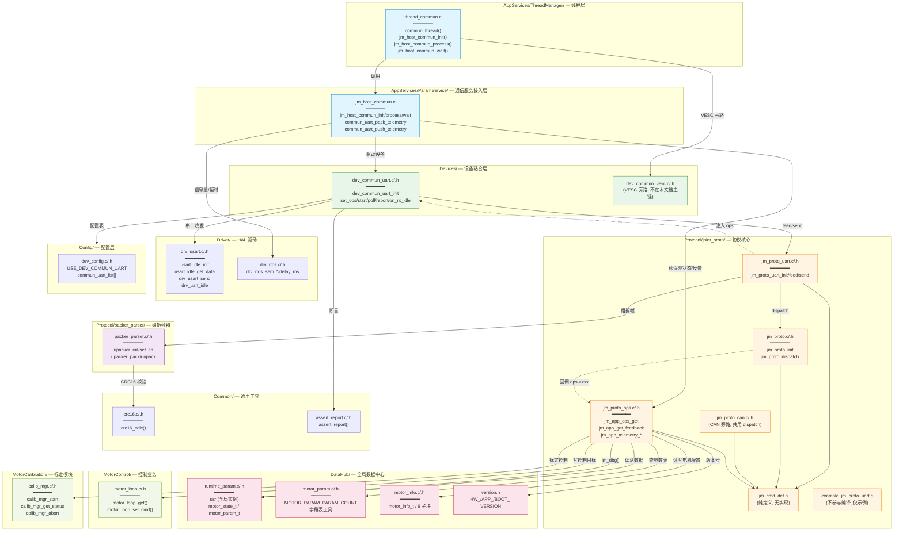

---

## 2. 文件分层与职责速查

按数据流方向（自顶向下为 RX 入口 → HAL，自底向上为业务回调），各文件分层如下：

| 层 | 文件 | 职责 | 关键导出 |
|----|------|------|----------|
| **L5 线程入口** | `thread_commun.c` | 通信线程主循环，调度 host | `commun_thread()` |
| **L4 服务接入** | `jm_host_commun.c` | 装配设备+注入ops+遥测分频打包 | `jm_host_commun_init/process/wait/notify_rx` |
| **L3 设备粘合** | `dev_commun_uart.c` | HAL↔协议栈桥接，DMA 取数与发送 | `dev_commun_uart_init` + 5 个方法指针 |
| **L2 串口绑定** | `jm_proto_uart.c` | packer 组拆帧 + 调 dispatch + 封帧回送 | `jm_proto_uart_init/feed/send` |
| **L2' 组拆帧** | `packer_parser.c` | 字节流状态机 + CRC16 校验 | `upacker_init/set_cb/pack/unpack` |
| **L2'' 通用工具** | `crc16.c` | CRC16 算法 | `crc16_calc()` |
| **L1 协议核心** | `jm_proto.c` | 传输无关的命令分发 + 应答组织 | `jm_proto_init/dispatch` |
| **L0 定义** | `jm_cmd_def.h` | 命令码/错误码/类型码/宏 | （纯宏与枚举） |
| **L3' 业务回调** | `jm_proto_ops.c` | ops 接口实现，对接电机控制/参数 | `jm_app_ops_get/get_feedback/telemetry_*` |
| **L6 HAL 驱动** | `drv_usart.c` | USART+DMA+IDLE 收发 | `usart_idle_init/get_data`、`drv_usart_send` |
| **L6' RTOS** | `drv_rtos.c` | 信号量/延时 | `drv_rtos_sem_*` |
| **L7 数据中心** | `runtime_param.c` / `motor_param.c` / `motor_info.c` / `version.h` | 活数据/参数表/配置/版本 | `usr`、`s_param_tbl`、`motor_info_*` |
| **L7' 控制业务** | `motor_loop.c` | 控制目标写入与状态机触发 | `motor_loop_get/set_cmd` |
| **L7'' 标定** | `calib_mgr.c` | 标定启动/查询/中止 | `calib_mgr_start/get_status/abort` |

---

## 3. RX 数据通路：字节流到电机动作

下图展示一帧命令从串口字节到触发电机动作的**完整调用栈**。每一步标注调用方→被调方→函数名。

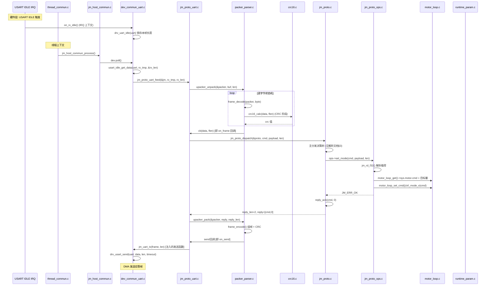

---

## 4. TX 数据通路：反馈/遥测到串口字节流

下图展示**周期遥测 0xCA**（电机→上位机，无应答）的调用栈，体现主动上报路径。

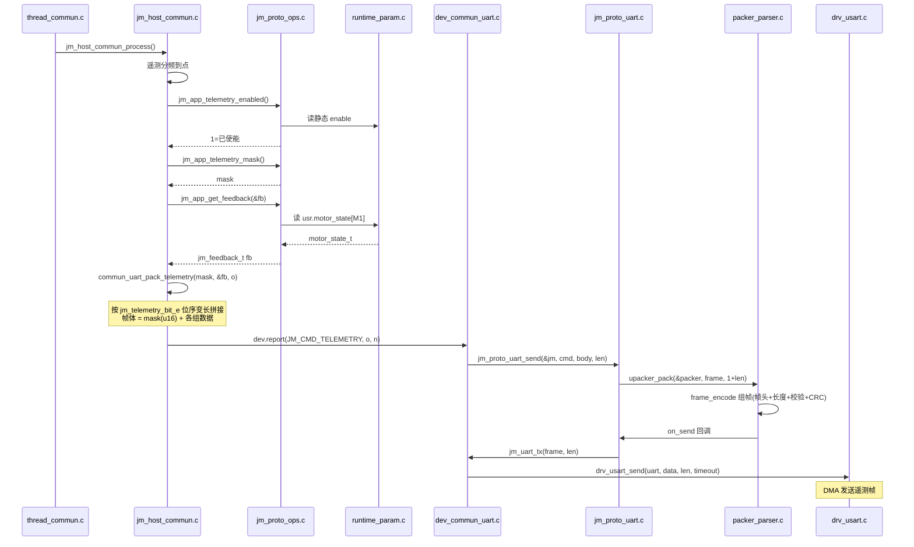

---

## 5. 逐文件调用关系详图

### 5.1 thread_commun.c — 通信线程入口

**位置**：`User/AppServices/ThreadManager/thread_commun.c`

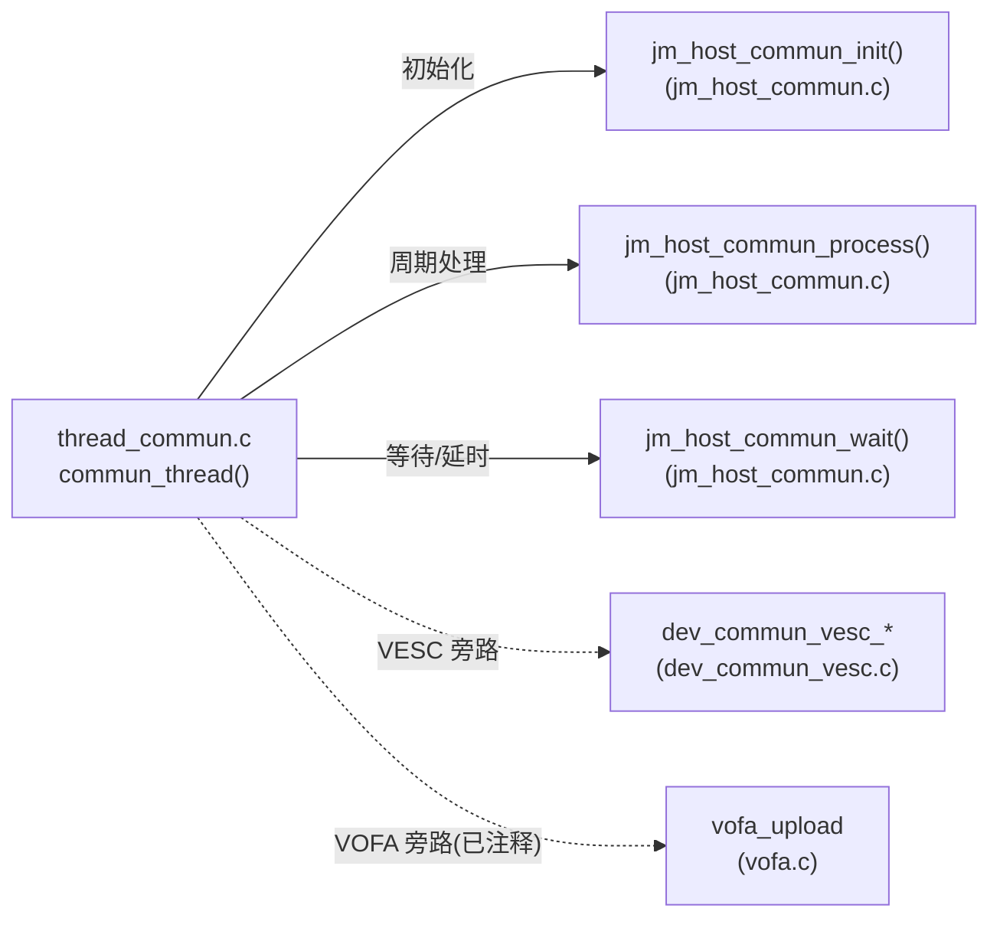

**调用关系**：
- `jm_host_commun_init()` → 装配设备 + 注入 ops + 启动接收
- `jm_host_commun_process()` → 每拍 poll + 遥测分频
- `jm_host_commun_wait(THREAD_DELAY_COMMUN)` → 信号量等待（RX 唤醒或超时）

**include 依赖**：`drv_rtos.h`、`runtime_param.h`、`thread_config.h`、`thread_commun.h`、`vofa.h`、`main.h`、`dev_commun_vesc.h`、`jm_host_commun.h`

---

### 5.2 jm_host_commun.c — 通信服务接入层

**位置**：`User/AppServices/ParamService/jm_host_commun.c`

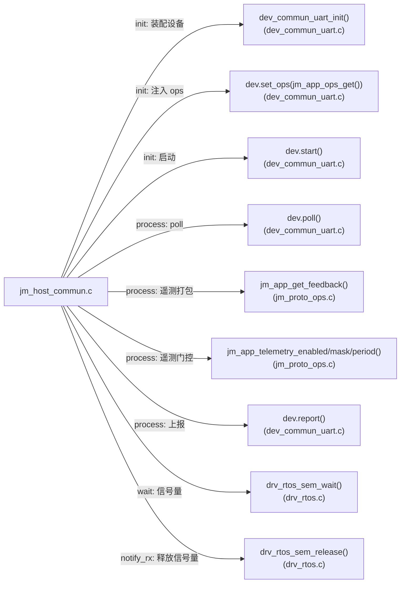

**核心逻辑**：
- `jm_host_commun_init()`：创建 RX 信号量 → 初始化设备 → 注入 `jm_app_ops_get()` 单例 → 启动 DMA 接收
- `jm_host_commun_process()`：调 `dev.poll()` 驱动命令分发 → 检查遥测使能 → 按 `period_ms` 分频 → 调 `commun_uart_push_telemetry()` 打包上报
- `commun_uart_pack_telemetry()`：按 `jm_telemetry_bit_e` 位序变长拼接 10 组数据

**include 依赖**：`runtime_param.h`、`thread_config.h`、`drv_rtos.h`、`dev_commun_uart.h`、`jm_proto_ops.h`

---

### 5.3 dev_commun_uart.c — 设备粘合层

**位置**：`User/Devices/dev_commun_uart.c`

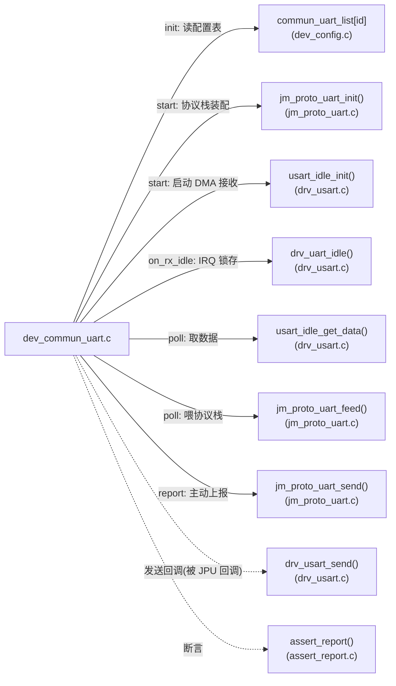

**关键设计**：
- `jm_uart_tx()` 静态函数作为发送回调注入 `jm_proto_uart_init`，被 `jm_proto_uart.c` 的 `on_send` 回调
- `s_active` 模块级指针：因 packer 回调无上下文参数，用活动实例指针路由到正确串口（单链路设计）
- `poll()` 取数后立即 `jm_proto_uart_feed()`，**在同一线程上下文**完成 dispatch + 应答发送

**include 依赖**：`dev_config.h`（含 `USE_DEV_COMMUN_UART`）、`drv_usart.h`、`jm_proto_uart.h`、`assert_report.h`

---

### 5.4 jm_proto_uart.c — 串口绑定层

**位置**：`User/Protocol/joint_proto/jm_proto_uart.c`

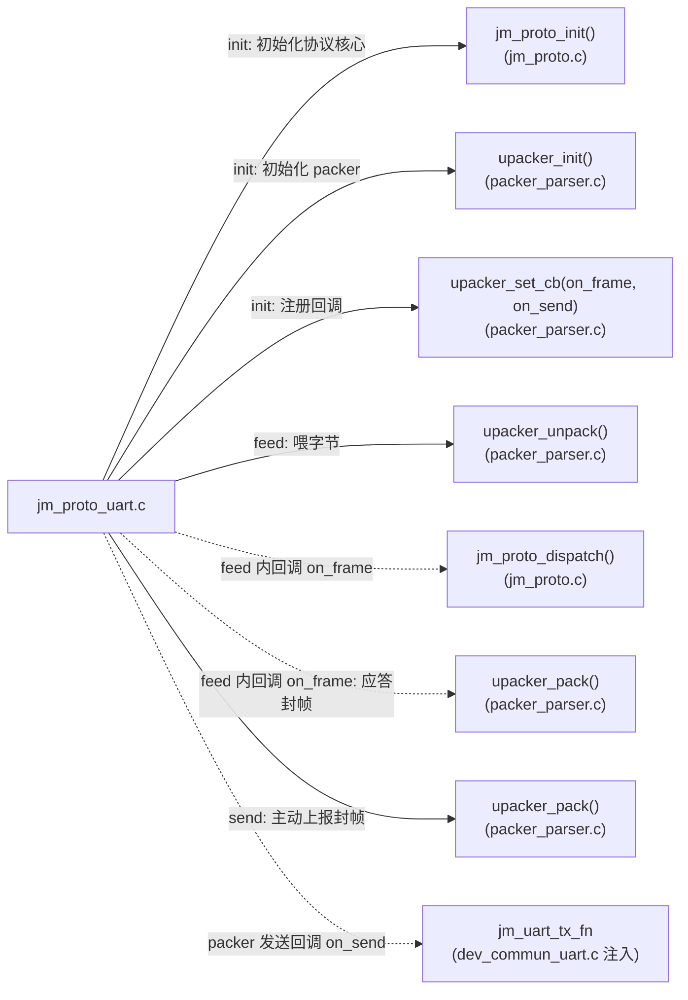

**回调闭环**：
1. `feed()` → `upacker_unpack()` → 逐字节状态机
2. 收齐整帧 → packer 调 `on_frame()` 回调
3. `on_frame()` → `jm_proto_dispatch()` → 业务处理 → 应答写入 `proto->reply`
4. `on_frame()` 检查 `reply_len > 0` → `upacker_pack()` 封帧
5. packer 封帧后调 `on_send()` 回调 → `jm_uart_tx_fn` 发出

**include 依赖**：`jm_proto.h`、`packer_parser.h`

---

### 5.5 packer_parser.c — 组拆帧器

**位置**：`User/Protocol/packer_parser/packer_parser.c`

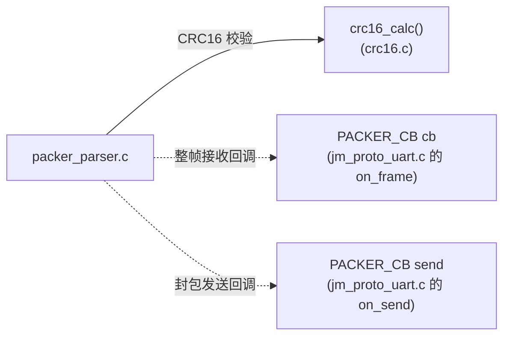

**核心实现**：
- `frame_decode()`：8 态状态机（HEADER_HIGH → HEADER_LOW → LEN_HIGH → LEN_LOW → HEADER_CHK → DATA_RECV → CRC_LOW → CRC_HIGH）
- `frame_encode()`：组帧为 `[0xA5][0x5A][LEN_HI][LEN_LO][HDR_CHK][DATA...][CRC_LO][CRC_HI]`
- `send_buffer[SEND_BUF_SIZE]`：**单全局静态缓冲**（约束：每个上报节拍只发一帧，无发送忙查询）
- 头校验：`(STX_H + STX_L + LEN_HI + LEN_LO) & 0xFF`
- 数据校验：`crc16_calc(data, flen)`，小端落帧

**include 依赖**：`packer_parser.h`、`crc16.h`、`string.h`

> 注：`packer_parser` 是协议栈中**唯一依赖 `crc16.c`**的文件，CRC16 校验逻辑集中于此。

---

### 5.6 jm_proto.c — 协议核心分发

**位置**：`User/Protocol/joint_proto/jm_proto.c`

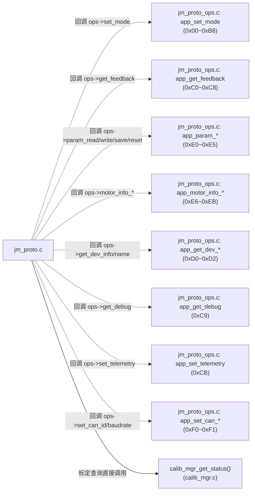

**关键设计**：
- `dispatch` 是**唯一入口**，串口/CAN 共用
- 应答组织三件套：`reply_set` / `reply_ack` / `reply_nack`（均写入 `proto->reply[]` 与 `reply_len`）
- `pack_feedback()` 把 `jm_feedback_t` 打包为 22B 全精度应答（仅 UART 路径用，CAN 路径自行重新压缩）
- 0x97 标定查询**绕过 ops**，直接调 `calib_mgr_get_status()` 返回 8B 详细状态

**include 依赖**：`jm_proto.h`、`calib_mgr.h`、`string.h`

---

### 5.7 jm_proto_ops.c — 业务回调实现

**位置**：`User/Protocol/joint_proto/jm_proto_ops.c`

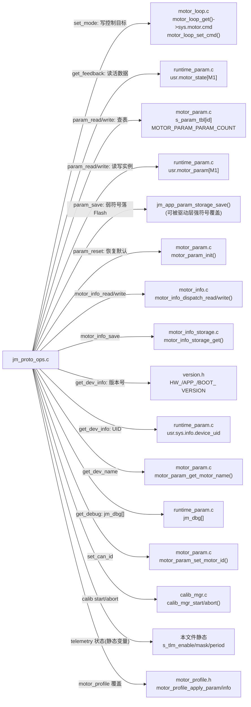

**核心数据通路**：
- **参数读写双依赖**：`motor_param.c` 提供元数据（字段表 `s_param_tbl`：offset/type/size），`runtime_param.c` 提供活数据（`usr.motor_param[M1]` 实例内存）。读写时先查表得 offset，再按 offset 直接内存拷贝（Cortex-M 小端，与协议小端一致，无需转换）。
- **反馈读取**：直接从 `usr.motor_state[M1]` 的 `motion/electrical/power/thermal/fault` 子结构填充 `jm_feedback_t`。
- **标定控制**：`set_mode` 收到 0x90~0x96 时调 `calib_mgr_start(level, submode)`，失败按状态分类返回 BUSY/STATE_DENY/OUT_OF_RANGE。

**include 依赖**：`jm_proto_ops.h`、`runtime_param.h`、`motor_param.h`、`motor_profile.h`、`version.h`、`motor_loop.h`、`motor_info.h`、`motor_info_storage.h`、`calib_mgr.h`

---

## 6. 头文件 include 依赖图

下图展示协议栈相关头文件的依赖关系（自上而下为依赖方向）。

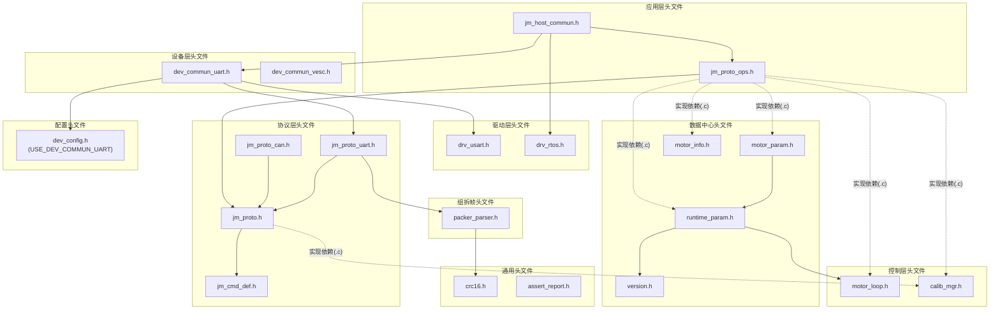

> 实线=头文件直接 include；虚线=.c 实现文件依赖（非头文件传递）。

---

## 7. 关键数据结构在各文件间的流转

下图展示协议栈中几个核心数据结构**在哪个文件产生、在哪个文件消费**。

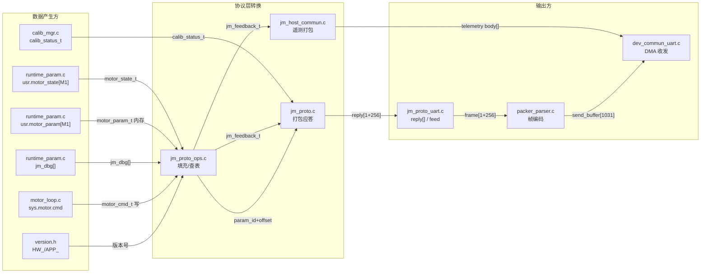

**核心数据结构与流转**：

| 数据结构 | 产生方 | 消费方 | 流转路径 |
|---------|--------|--------|----------|
| `motor_state_t` | `runtime_param.c`（电流环 ISR 写） | `jm_proto_ops.c:app_get_feedback` | `usr.motor_state[M1]` → `jm_feedback_t` → `reply[]` |
| `motor_param_t` | `runtime_param.c`（默认值 + 协议写入） | `jm_proto_ops.c:app_param_*` | `usr.motor_param[M1]` ↔ `s_param_tbl` 查表读写 |
| `motor_cmd_t` | `jm_proto_ops.c:app_set_mode` 写 | `motor_loop.c` 电流环 ISR 读 | `sys.motor.cmd` 单生产者单消费者无锁 |
| `jm_feedback_t` | `jm_proto_ops.c` 填充 | `jm_proto.c:pack_feedback` / `jm_host_commun.c:pack_telemetry` | 中转结构，转成应答字节 |
| `reply[1+256]` | `jm_proto.c` 写 | `jm_proto_uart.c` 读 | dispatch 出参，绑定层封帧 |
| `calib_status_t` | `calib_mgr.c` | `jm_proto.c`（0x97 直接读） | 直接打包为 8B 应答 |
| `jm_dbg[]` | 任意模块写 | `jm_proto_ops.c:app_get_debug` / `jm_host_commun.c` | 调试观测点，免改协议 |

---

## 8. 回调注入链路

协议栈采用**回调注入**实现解耦。下图展示所有回调的注入点与被调方。

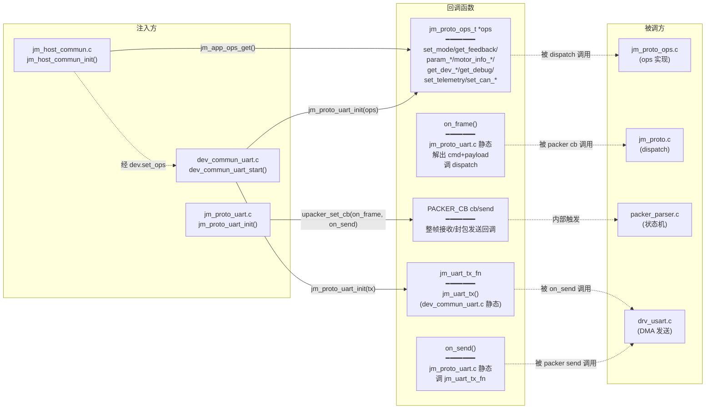

**注入顺序**（初始化时序）：

1. `jm_host_commun_init()` 创建信号量
2. `dev_commun_uart_init()` 读配置表填充 `pobj->uart/motor_id`
3. `dev.set_ops(jm_app_ops_get())` → 注入业务回调
4. `dev.start()` 内部调 `jm_proto_uart_init(&jm, ops, motor_id, jm_uart_tx)`：
   - 注入 `ops` 到 `jm_proto_t`
   - 注入 `jm_uart_tx` 到 `jm_proto_uart_t`（作为 packer 的 send 回调）
5. `upacker_set_cb(on_frame, on_send)` → 注入 packer 的接收/发送回调
6. `usart_idle_init()` → 启动 DMA + IDLE 中断

---

## 9. 编译开关与条件包含

协议栈通过编译开关控制特性裁剪：

| 宏 | 定义位置 | 作用 | 影响文件 |
|----|---------|------|---------|
| `USE_DEV_COMMUN_UART` | `dev_config.h`（板级） | 启用 joint_proto 串口通信链路 | `dev_commun_uart.c`、`jm_host_commun.c`、`thread_commun.c` |
| `USE_DEV_COMMUN_VESC` | `dev_config.h`（板级） | 启用 VESC Tool 兼容链路 | `dev_commun_vesc.c`、`thread_commun.c` |
| `USE_DATA_CHECK` | `packer_parser.h` | 启用 CRC16 + 头校验 | `packer_parser.c` |
| `USE_DYNAMIC_MEM` | `packer_parser.h` | packer 缓冲动态分配（默认静态） | `packer_parser.c` |
| `MAX_PACK_SIZE` | `packer_parser.h` | 单帧数据区上限（默认 1024） | `packer_parser.c/.h` |
| `JM_PAYLOAD_MAX` | `jm_proto.h` | 协议层载荷上限（256） | `jm_proto.c/.h` |
| `JM_DBG_CH` | `jm_proto_ops.h` 或配置 | 调试通道数量 | `jm_proto_ops.c`、`jm_host_commun.c` |

**典型板级配置**（`Board/V1/Config/dev_config_board.h`）：

```c
#define USE_DEV_COMMUN_UART   1   /* 启用 joint_proto 串口 */
#define USE_DEV_COMMUN_VESC   0   /* 禁用 VESC 兼容 */
```

---

## 附：文件清单与跨目录归属

| 目录 | 文件 | 职责 |
|------|------|------|
| `AppServices/ThreadManager/` | `thread_commun.c/.h` | 通信线程入口 |
| `AppServices/ParamService/` | `jm_host_commun.c/.h` | 通信服务接入 + 遥测打包 |
| `Devices/` | `dev_commun_uart.c/.h` | UART 设备粘合层 |
| `Devices/` | `dev_commun_vesc.c/.h` | VESC 设备粘合层（旁路） |
| `Protocol/joint_proto/` | `jm_proto.c/.h` | 协议核心 dispatch |
| `Protocol/joint_proto/` | `jm_proto_uart.c/.h` | 串口绑定层 |
| `Protocol/joint_proto/` | `jm_proto_can.c/.h` | CAN 绑定层（旁路） |
| `Protocol/joint_proto/` | `jm_proto_ops.c/.h` | 业务回调实现 |
| `Protocol/joint_proto/` | `jm_cmd_def.h` | 命令码/错误码/类型码 |
| `Protocol/joint_proto/` | `example_jm_proto_uart.c` | 接入示例（不编译） |
| `Protocol/packer_parser/` | `packer_parser.c/.h` | 组拆帧器 |
| `Common/` | `crc16.c/.h` | CRC16 算法 |
| `Common/` | `assert_report.c/.h` | 断言上报 |
| `Driver/` | `drv_usart.c/.h` | USART+DMA+IDLE 驱动 |
| `Driver/` | `drv_rtos.c/.h` | RTOS 信号量/延时 |
| `DataHub/` | `runtime_param.c/.h` | 活数据全局实例 |
| `DataHub/` | `motor_param.c/.h` | 参数表元数据 |
| `DataHub/` | `motor_info.c/.h` | MotorInfo 持久化配置 |
| `DataHub/` | `version.h` | 版本号 |
| `MotorControl/CascadeControl/` | `motor_loop.c/.h` | 控制目标写入 |
| `MotorCalibration/` | `calib_mgr.c/.h` | 标定管理器 |
| `Config/` | `dev_config.c/.h` | 设备配置表 + 编译开关 |
