# joint_proto 协议解析流程详解

> 本文档聚焦 `User/Protocol/joint_proto/` 目录下 **命令分发与载荷解析** 的具体流程，
> 配以详细的判定框图与字节级布局。架构总览请参阅 [joint_proto_layer_diagram.md](joint_proto_layer_diagram.md)，
> 命令清单请参阅 [joint_motor_command_list.csv](joint_motor_command_list.csv)，
> 协议规范请参阅 [joint_motor_protocol_spec.md](joint_motor_protocol_spec.md)。
>
> **渲染**:VS Code / Trae 安装 "Markdown Preview Mermaid Support" 插件，或推送至 GitHub 可直接渲染 Mermaid 图。

---

## 目录

- [1. 协议解析全景图](#1-协议解析全景图)
- [2. 入口契约：jm_proto_dispatch](#2-入口契约jm_proto_dispatch)
- [3. 主分发决策树](#3-主分发决策树)
- [4. 命令类别逐类解析](#4-命令类别逐类解析)
  - [4.1 遥测订阅 0xCB](#41-遥测订阅-0xcb)
  - [4.2 反馈查询 0xC0~0xC9](#42-反馈查询-0xc00xc9)
  - [4.3 设备信息 0xD0~0xD2](#43-设备信息-0xd00xd2)
  - [4.4 参数读写 0xE0~0xEB](#44-参数读写-0xe00xeb)
  - [4.5 CAN 管理 0xF0~0xF2](#45-can-管理-0xf00xf2)
  - [4.6 标定查询 0x97](#46-标定查询-0x97)
  - [4.7 控制/校准/诊断 0x00~0xB8](#47-控制校准诊断-0x000xb8)
- [5. 应答组织：ACK / NACK / Reply](#5-应答组织ack--nack--reply)
- [6. 小端编解码助手](#6-小端编解码助手)
- [7. 典型命令端到端解析实例](#7-典型命令端到端解析实例)
- [8. UART 与 CAN 解析差异](#8-uart-与-can-解析差异)
- [9. 错误码与失败定位](#9-错误码与失败定位)

---

## 1. 协议解析全景图

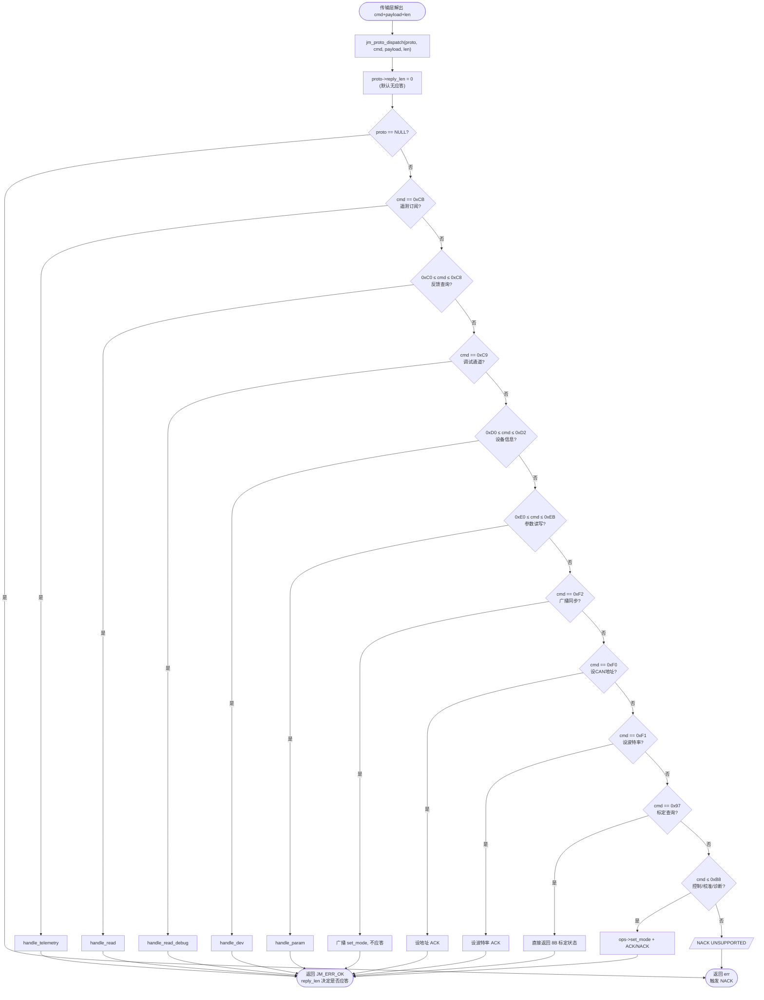
```mermaid
flowchart TB
    START([传输层解出 cmd+payload+len])
    ENTRY["jm_proto_dispatch(proto, cmd, payload, len)"]
    RESET["proto->reply_len = 0<br/>(默认无应答)"]
    NULLCHK{"proto == NULL?"}

    TELEM{"cmd == 0xCB<br/>遥测订阅?"}
    READ{"0xC0 ≤ cmd ≤ 0xC8<br/>反馈查询?"}
    DEBUG{"cmd == 0xC9<br/>调试通道?"}
    DEV{"0xD0 ≤ cmd ≤ 0xD2<br/>设备信息?"}
    PARAM{"0xE0 ≤ cmd ≤ 0xEB<br/>参数读写?"}
    BCAST{"cmd == 0xF2<br/>广播同步?"}
    CANID{"cmd == 0xF0<br/>设CAN地址?"}
    BAUD{"cmd == 0xF1<br/>设波特率?"}
    CALIBQ{"cmd == 0x97<br/>标定查询?"}
    CTRL{"cmd ≤ 0xB8<br/>控制/校准/诊断?"}
    UNSUP[/"NACK UNSUPPORTED"/]

    END_OK([返回 JM_ERR_OK<br/>reply_len 决定是否应答])
    END_ERR([返回 err<br/>触发 NACK])

    START --> ENTRY --> RESET --> NULLCHK
    NULLCHK -->|"是"| END_ERR
    NULLCHK -->|"否"| TELEM
    TELEM -->|"是"| H_TELEM["handle_telemetry"]
    TELEM -->|"否"| READ
    READ -->|"是"| H_READ["handle_read"]
    READ -->|"否"| DEBUG
    DEBUG -->|"是"| H_DEBUG["handle_read_debug"]
    DEBUG -->|"否"| DEV
    DEV -->|"是"| H_DEV["handle_dev"]
    DEV -->|"否"| PARAM
    PARAM -->|"是"| H_PARAM["handle_param"]
    PARAM -->|"否"| BCAST
    BCAST -->|"是"| H_BCAST["广播 set_mode, 不应答"]
    BCAST -->|"否"| CANID
    CANID -->|"是"| H_CANID["设地址 ACK"]
    CANID -->|"否"| BAUD
    BAUD -->|"是"| H_BAUD["设波特率 ACK"]
    BAUD -->|"否"| CALIBQ
    CALIBQ -->|"是"| H_CALIBQ["直接返回 8B 标定状态"]
    CALIBQ -->|"否"| CTRL
    CTRL -->|"是"| H_CTRL["ops->set_mode + ACK/NACK"]
    CTRL -->|"否"| UNSUP

    H_TELEM --> END_OK
    H_READ --> END_OK
    H_DEBUG --> END_OK
    H_DEV --> END_OK
    H_PARAM --> END_OK
    H_BCAST --> END_OK
    H_CANID --> END_OK
    H_BAUD --> END_OK
    H_CALIBQ --> END_OK
    H_CTRL --> END_OK
    UNSUP --> END_ERR
```

**关键判定顺序**：dispatch 按上图的优先级自上而下匹配，**先匹配先处理**，互不重叠。最后兜底的 `cmd <= 0xB8` 把所有控制/校准/诊断命令统一交给 `ops->set_mode`。

---

## 2. 入口契约：jm_proto_dispatch

```c
jm_err_e jm_proto_dispatch(jm_proto_t *proto, uint8_t cmd,
                           const uint8_t *payload, uint16_t len);
```

| 参数 | 含义 | 约束 |
|------|------|------|
| `proto` | 协议实例（含 ops 与 reply 缓冲） | 不可为 NULL，否则直接返回 `JM_ERR_STATE_DENY` |
| `cmd` | 命令码（已由传输层解出） | 范围 `0x00 ~ 0xFE` |
| `payload` | 载荷起始指针，不含 cmd | `len=0` 时可为 `NULL` |
| `len` | 载荷字节数 | CAN 的 MIT 帧在此前已归一化为 20B |

**出参**（写入 `proto` 实例）：

| 字段 | 含义 |
|------|------|
| `proto->reply[0]` | 应答命令码（通常等于触发命令的 cmd） |
| `proto->reply[1..]` | 应答载荷 |
| `proto->reply_len` | 含 cmd 的总长；`0` 表示无需应答 |
| 返回值 `jm_err_e` | 仅作状态信息；绑定层判定"是否回送应答"**只看 `reply_len > 0`** |

**契约不变量**：

1. `dispatch` 内部把 `reply_len` 置 0 作为默认值，只有显式调用 `reply_set`/`reply_ack`/`reply_nack` 才会置非 0
2. 任何路径要么返回 `JM_ERR_OK`（已组织好应答或无需应答），要么返回非 0 错误码（同时已组织好 NACK 应答）
3. `payload` 生命周期仅限 `dispatch` 调用期间；如需异步保留须由回调自行拷贝

---

## 3. 主分发决策树

`jm_proto_dispatch` 是协议解析的**唯一入口**。串口与 CAN 两条传输链路在解出 `(cmd, payload, len)` 后都收敛到这里。判定顺序如下：

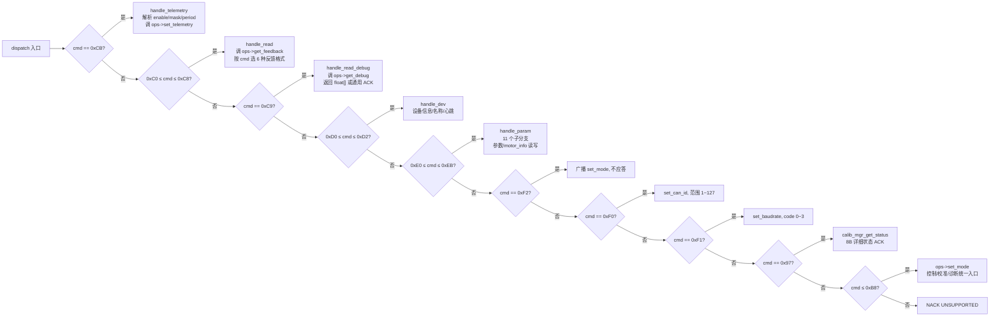
```mermaid
flowchart LR
    D["dispatch 入口"]
    D --> C1{"cmd == 0xCB?"}
    C1 -->|是| A1["handle_telemetry<br/>解析 enable/mask/period<br/>调 ops->set_telemetry"]
    C1 -->|否| C2{"0xC0 ≤ cmd ≤ 0xC8?"}
    C2 -->|是| A2["handle_read<br/>调 ops->get_feedback<br/>按 cmd 选 6 种反馈格式"]
    C2 -->|否| C3{"cmd == 0xC9?"}
    C3 -->|是| A3["handle_read_debug<br/>调 ops->get_debug<br/>返回 float[] 或通用 ACK"]
    C3 -->|否| C4{"0xD0 ≤ cmd ≤ 0xD2?"}
    C4 -->|是| A4["handle_dev<br/>设备信息/名称/心跳"]
    C4 -->|否| C5{"0xE0 ≤ cmd ≤ 0xEB?"}
    C5 -->|是| A5["handle_param<br/>11 个子分支<br/>参数/motor_info 读写"]
    C5 -->|否| C6{"cmd == 0xF2?"}
    C6 -->|是| A6["广播 set_mode, 不应答"]
    C6 -->|否| C7{"cmd == 0xF0?"}
    C7 -->|是| A7["set_can_id, 范围 1~127"]
    C7 -->|否| C8{"cmd == 0xF1?"}
    C8 -->|是| A8["set_baudrate, code 0~3"]
    C8 -->|否| C9{"cmd == 0x97?"}
    C9 -->|是| A9["calib_mgr_get_status<br/>8B 详细状态 ACK"]
    C9 -->|否| C10{"cmd ≤ 0xB8?"}
    C10 -->|是| A10["ops->set_mode<br/>控制/校准/诊断统一入口"]
    C10 -->|否| A11["NACK UNSUPPORTED"]
```

**判定顺序的设计意图**：

- **特殊命令优先**：遥测订阅、CAN 管理、标定查询有独立的解析路径，不走 `set_mode`
- **区间批量分流**：反馈查询、设备信息、参数读写按 CMD 区间一次性分流到子处理器
- **兜底通用路径**：`cmd <= 0xB8` 涵盖系统控制（0x00~0x0F）、运动控制（0x10~0x2F）、高级力控（0x30~0x4F）、轨迹同步（0x50~0x6F）、特殊应用（0x70~0x8F）、校准启动（0x90~0x96）、标定中止（0x98）、系统诊断（0xB0~0xB8），全部由 `ops->set_mode` 解释

---

## 4. 命令类别逐类解析

### 4.1 遥测订阅 0xCB

**CMD**: `JM_CMD_SET_TELEMETRY = 0xCB`

**载荷布局**：

```
偏移  [0]       [1..2]      [3..4]        (可选)
字段  enable    mask        period_ms
类型  u8        u16 LE      u16 LE
单位  1=启动    位掩码      ms
      0=停止   jm_telemetry_bit_e
```

**解析流程**：

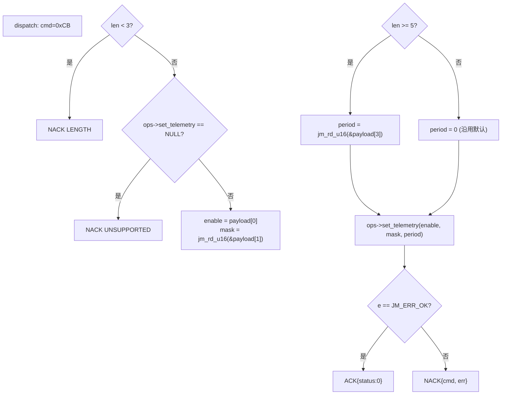
```mermaid
flowchart TB
    S0["dispatch: cmd=0xCB"]
    L1{"len < 3?"}
    L1 -->|是| N1["NACK LENGTH"]
    L1 -->|否| L2{"ops->set_telemetry == NULL?"}
    L2 -->|是| N2["NACK UNSUPPORTED"]
    L2 -->|否| P1["enable = payload[0]<br/>mask = jm_rd_u16(&payload[1])"]
    L3{"len >= 5?"}
    L3 -->|是| P2["period = jm_rd_u16(&payload[3])"]
    L3 -->|否| P3["period = 0 (沿用默认)"]
    P2 --> CALL["ops->set_telemetry(enable, mask, period)"]
    P3 --> CALL
    CALL --> L4{"e == JM_ERR_OK?"}
    L4 -->|是| ACK["ACK{status:0}"]
    L4 -->|否| NACK["NACK{cmd, err}"]
```

**应答**：单次 ACK（仅订阅命令本身回一次确认），之后周期性 0xCA 数据帧由绑定层主动推送，**不要求逐帧应答**。

**位掩码定义**（`jm_telemetry_bit_e`）：

| 位 | 宏 | 内容 | 字节数 |
|----|-----|------|--------|
| 0 | `JM_TLM_POS_VEL` | pos(f32) + vel(f32) | 8 |
| 1 | `JM_TLM_DQ` | id(f32) + iq(f32) | 8 |
| 2 | `JM_TLM_PHASE` | ia, ib, ic(f32) | 12 |
| 3 | `JM_TLM_BUS` | vbus, ibus, power(f32) | 12 |
| 4 | `JM_TLM_TEMP` | tempFet, tempMotor(f32) | 8 |
| 5 | `JM_TLM_MULTITURN` | multiturn(u32) + single(f32) | 8 |
| 6 | `JM_TLM_TORQUE` | torque(f32) | 4 |
| 7 | `JM_TLM_FAULT` | fault(u32) + warn(u32) | 8 |
| 8 | `JM_TLM_STATE` | topFsm/runState/ctrlMode/enable(u8) | 4 |
| 9 | `JM_TLM_DEBUG` | jm_dbg[JM_DBG_CH](f32) | N×4 |

---

### 4.2 反馈查询 0xC0~0xC9

**入口**：`handle_read(proto, cmd)`，统一调 `ops->get_feedback(&fb)` 填充 `jm_feedback_t`，再按 cmd 选不同打包格式。

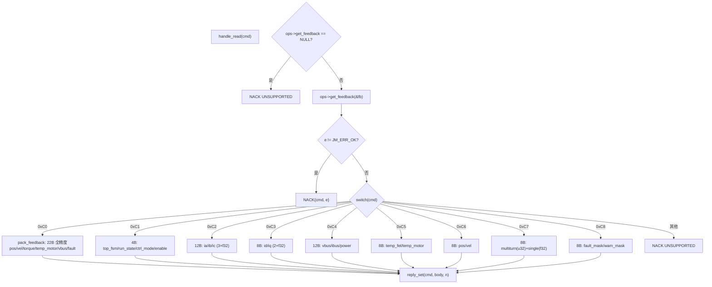
```mermaid
flowchart TB
    E["handle_read(cmd)"]
    L1{"ops->get_feedback == NULL?"}
    L1 -->|是| N1["NACK UNSUPPORTED"]
    L1 -->|否| CALL["ops->get_feedback(&fb)"]
    CALL --> L2{"e != JM_ERR_OK?"}
    L2 -->|是| N2["NACK{cmd, e}"]
    L2 -->|否| SW{"switch(cmd)"}

    SW -->|0xC0| F1["pack_feedback: 22B 全精度<br/>pos/vel/torque/temp_motor/vbus/fault"]
    SW -->|0xC1| F2["4B: top_fsm/run_state/ctrl_mode/enable"]
    SW -->|0xC2| F3["12B: ia/ib/ic (3×f32)"]
    SW -->|0xC3| F4["8B: id/iq (2×f32)"]
    SW -->|0xC4| F5["12B: vbus/ibus/power"]
    SW -->|0xC5| F6["8B: temp_fet/temp_motor"]
    SW -->|0xC6| F7["8B: pos/vel"]
    SW -->|0xC7| F8["8B: multiturn(u32)+single(f32)"]
    SW -->|0xC8| F9["8B: fault_mask/warn_mask"]
    SW -->|其他| N3["NACK UNSUPPORTED"]

    F1 --> R["reply_set(cmd, body, n)"]
    F2 --> R
    F3 --> R
    F4 --> R
    F5 --> R
    F6 --> R
    F7 --> R
    F8 --> R
    F9 --> R
```

**0xC0 READ_FEEDBACK 应答载荷（22B，小端）**：

```
偏移  [0..3]     [4..7]     [8..11]    [12..15]   [16..19]   [20..21]
字段  pos        vel        torque     temp_motor vbus       fault_mask
类型  f32 LE     f32 LE     f32 LE     f32 LE     f32 LE     u16 LE
单位  rad        rad/s      Nm         ℃          V          位
```

> `vel` 保持原始机械角速度语义；滤波速度通过独立观测字段提供。CAN 路径对 0xC0 不使用此 22B 全精度应答，而是**重新调用** `get_feedback` + `jm_fb_pack` 压成 8B 定点（见 [§8](#8-uart-与-can-解析差异)）。

**0xC9 READ_DEBUG**（`handle_read_debug`）：

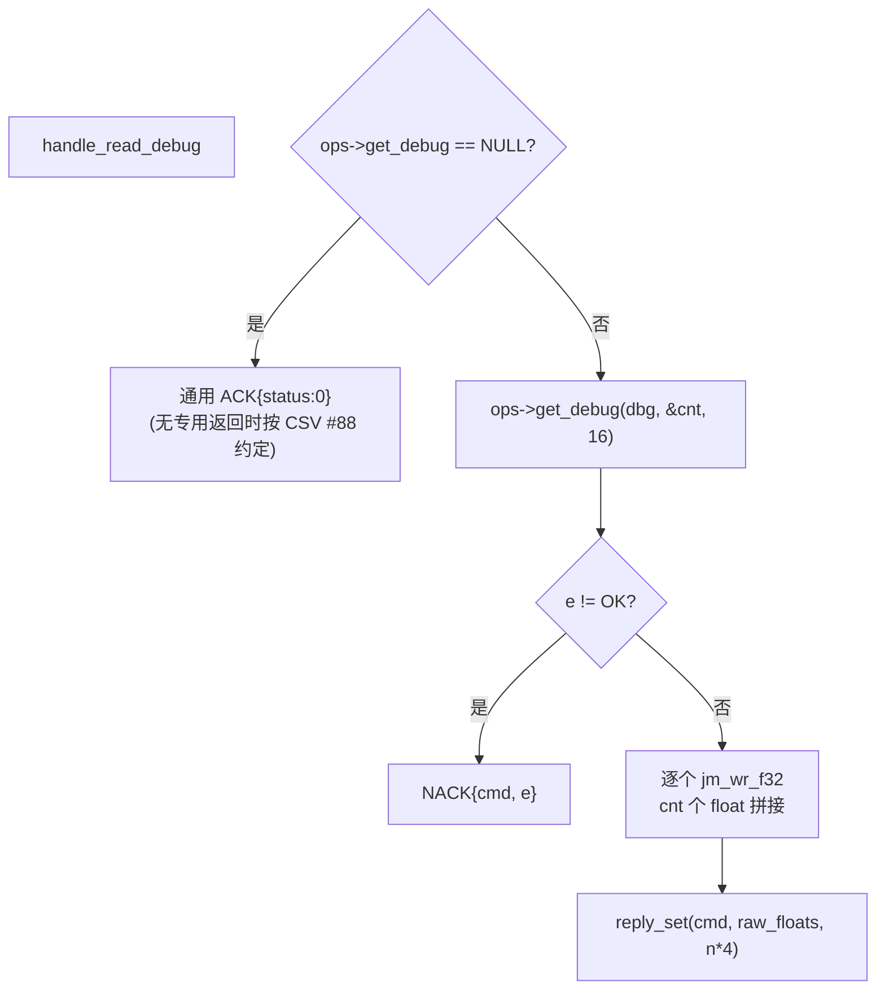
```mermaid
flowchart TB
    E["handle_read_debug"]
    L1{"ops->get_debug == NULL?"}
    L1 -->|是| ACK["通用 ACK{status:0}<br/>(无专用返回时按 CSV #88 约定)"]
    L1 -->|否| CALL["ops->get_debug(dbg, &cnt, 16)"]
    CALL --> L2{"e != OK?"}
    L2 -->|是| NACK["NACK{cmd, e}"]
    L2 -->|否| PACK["逐个 jm_wr_f32<br/>cnt 个 float 拼接"]
    PACK --> REPLY["reply_set(cmd, raw_floats, n*4)"]
```

应答载荷为 N×4 字节（纯 f32 拼接，无计数字节），与 0xCA 遥测 DEBUG 组同构。上位机按 `(reply_len-1)/4` 解析。

当 0xC9 携带 `offset:u16 + count:u8` 三字节请求时，协议层改为读取高速采样分块；
返回头包含状态、通道掩码、实际采样率、已提交点数、偏移和点数，后续为按通道排列的
f32 数据。C9 多帧响应使用 `JM_CAN_MULTI_FLAG`，不能被识别为主机请求。

---

### 4.3 设备信息 0xD0~0xD2

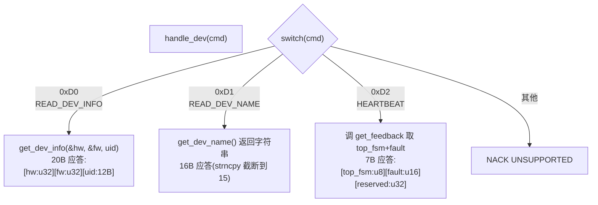
```mermaid
flowchart TB
    E["handle_dev(cmd)"]
    SW{"switch(cmd)"}

    SW -->|0xD0<br/>READ_DEV_INFO| F1["get_dev_info(&hw, &fw, uid)<br/>20B 应答:<br/>[hw:u32][fw:u32][uid:12B]"]
    SW -->|0xD1<br/>READ_DEV_NAME| F2["get_dev_name() 返回字符串<br/>16B 应答(strncpy 截断到 15)"]
    SW -->|0xD2<br/>HEARTBEAT| F3["调 get_feedback 取 top_fsm+fault<br/>7B 应答:<br/>[top_fsm:u8][fault:u16][reserved:u32]"]
    SW -->|其他| N["NACK UNSUPPORTED"]
```

**0xD0 应答（20B）**：

```
偏移  [0..3]   [4..7]   [8..19]
字段  hw_ver   fw_ver   uid[12]
类型  u32 LE   u32 LE   字节
```

**0xD2 HEARTBEAT 应答（7B）**：

```
偏移  [0]       [1..2]      [3..6]
字段  top_fsm   fault_mask  reserved
类型  u8        u16 LE      u32 LE
```

---

### 4.4 参数读写 0xE0~0xEB

`handle_param` 是**子分支最多**的处理器，共 11 个命令分两族：

| 族 | 命令 | 说明 |
|----|------|------|
| **运行时参数**（motor_param） | 0xE0/0xE1/0xE2/0xE3/0xE4/0xE5 | 单读/单写/批量读/批量写/保存/恢复默认 |
| **电机配置**（motor_info） | 0xE6/0xE7/0xE8/0xE9/0xEA/0xEB | 单读/单写/批量读/批量写/固化到Flash/恢复默认 |


```mermaid
flowchart TB
    E["handle_param(cmd, payload, len)"]
    SW{"switch(cmd)"}

    SW -->|0xE0<br/>PARAM_READ| P1["读单个参数<br/>入: {param_id:u16}<br/>出: {param_id:u16; type:u8; value}"]
    SW -->|0xE1<br/>PARAM_WRITE| P2["写单个参数<br/>入: {param_id:u16; value:bytes}<br/>出: {param_id:u16; status:u8}"]
    SW -->|0xE2<br/>PARAM_READ_BULK| P3["批量读<br/>入: {start_id:u16; count:u16}<br/>出: {start_id:u16; count:u8; [type:u8; value]...}"]
    SW -->|0xE3<br/>PARAM_WRITE_BULK| P4["批量写<br/>入: {start_id:u16; count:u16; values:bytes}<br/>出: {status:u8}"]
    SW -->|0xE4<br/>PARAM_SAVE| P5["保存到 Flash<br/>入: 无<br/>出: ACK{status:0}"]
    SW -->|0xE5<br/>PARAM_RESET| P6["恢复默认<br/>入: {param_id:u16 (0xFFFF=全部)}<br/>出: ACK{status:0}"]

    SW -->|0xE6<br/>MOTOR_INFO_READ| M1["读单个配置<br/>入: {param_id:u16}<br/>出: {param_id:u16; type:u8; value:4B}"]
    SW -->|0xE7<br/>MOTOR_INFO_WRITE| M2["写单个配置<br/>入: {param_id:u16; value:4B}<br/>出: {param_id:u16; status:u8}"]
    SW -->|0xE8<br/>MOTOR_INFO_READ_BULK| M3["批量读<br/>入: {start_id:u16; count:u16}<br/>出: {start_id:u16; count:u8; [value:4B]...}"]
    SW -->|0xE9<br/>MOTOR_INFO_WRITE_BULK| M4["批量写<br/>入: {start_id:u16; count:u16; [value:4B]...}<br/>出: {status:u8}"]
    SW -->|0xEA<br/>MOTOR_INFO_SAVE| M5["整块写 Flash<br/>入: 无<br/>出: ACK{status:0}"]
    SW -->|0xEB<br/>MOTOR_INFO_RESET| M6["恢复默认<br/>入: {param_id:u16 (0xFFFF=全部)}<br/>出: ACK{status:0}"]
    SW -->|其他| N["NACK UNSUPPORTED"]
```

**两族差异**：

| 维度 | motor_param (0xE0~0xE5) | motor_info (0xE6~0xEB) |
|------|--------------------------|------------------------|
| 用途 | 运行时控制参数（PID 增益等） | Flash 持久化的硬件配置/校准数据 |
| value 长度 | 按字段类型可变（1/2/4/16B） | **固定 4 字节**，固件按字段类型自动转换 |
| 批量读应答 | `[type:u8][value]...` 每值带 type | `[value:4B]...` 每值固定 4B |
| 持久化 | `param_save` 落 Flash | `motor_info_save` 整块 memcpy 写 Flash |
| ops 回调 | `param_read` / `param_write` / `param_save` / `param_reset` / `param_read_bulk` / `param_write_bulk` | `motor_info_read` / `motor_info_write` / `motor_info_save` / `motor_info_reset` / `motor_info_read_bulk` / `motor_info_write_bulk` |

**0xE0 PARAM_READ 详细流程**：

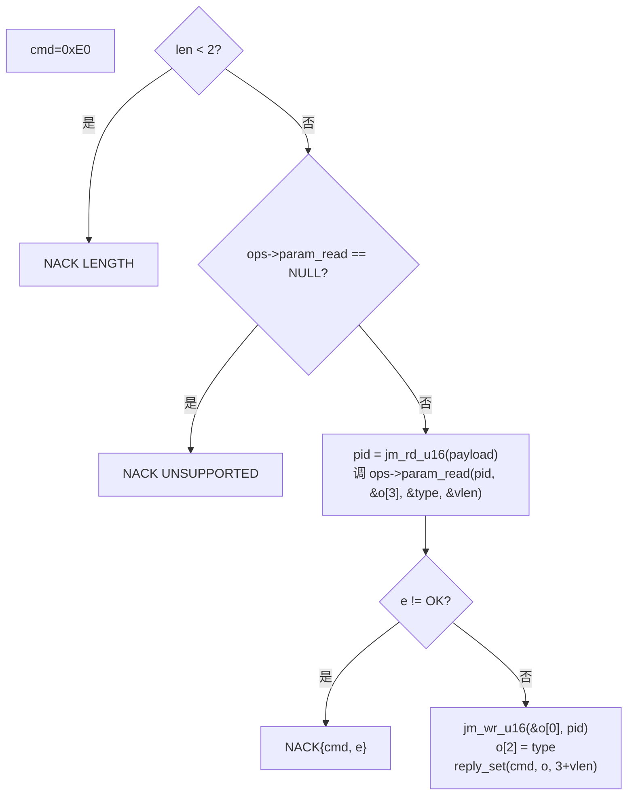
```mermaid
flowchart TB
    S0["cmd=0xE0"]
    L1{"len < 2?"} -->|是| N1["NACK LENGTH"]
    L1 -->|否| L2{"ops->param_read == NULL?"} -->|是| N2["NACK UNSUPPORTED"]
    L2 -->|否| P1["pid = jm_rd_u16(payload)<br/>调 ops->param_read(pid, &o[3], &type, &vlen)"]
    P1 --> L3{"e != OK?"} -->|是| N3["NACK{cmd, e}"]
    L3 -->|否| R1["jm_wr_u16(&o[0], pid)<br/>o[2] = type<br/>reply_set(cmd, o, 3+vlen)"]
```

**0xE0 应答载荷**：

```
偏移  [0..1]    [2]      [3..3+vlen-1]
字段  param_id  type     value
类型  u16 LE    u8       按 type 决定长度
```

`type` 取自 `jm_param_type_e`：U8=0, I8=1, U16=2, I16=3, U32=4, I32=5, F32=6, STR=7（STR 长度 16B）。

**0xE1 PARAM_WRITE 详细流程**：

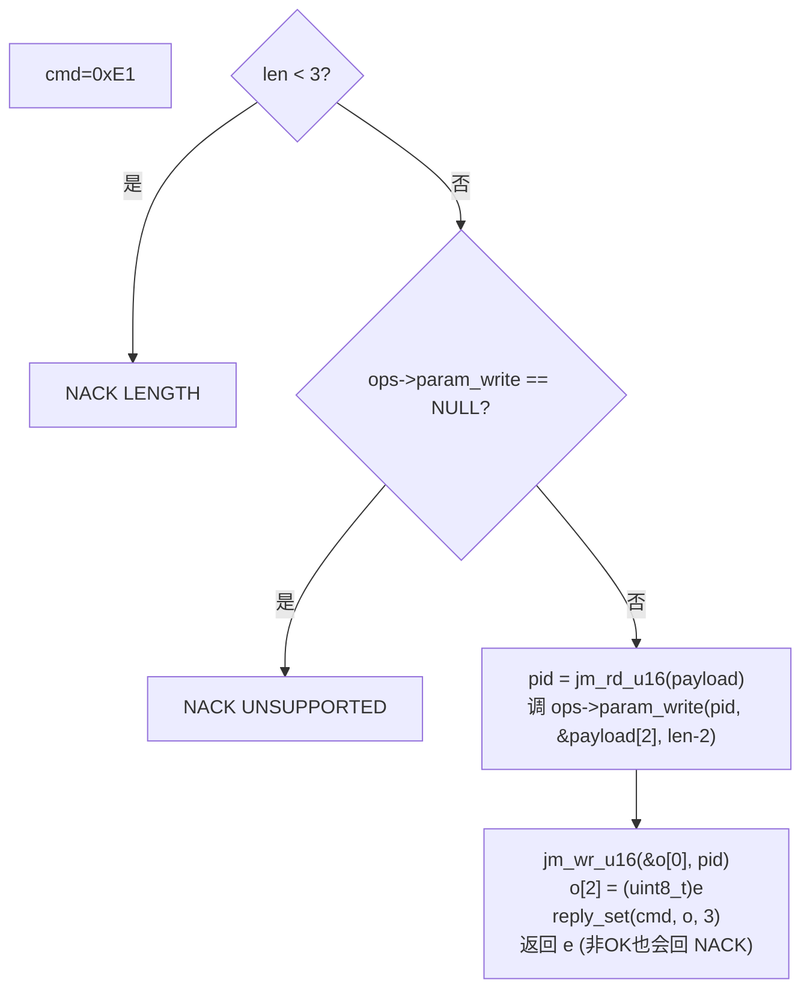
```mermaid
flowchart TB
    S0["cmd=0xE1"]
    L1{"len < 3?"} -->|是| N1["NACK LENGTH"]
    L1 -->|否| L2{"ops->param_write == NULL?"} -->|是| N2["NACK UNSUPPORTED"]
    L2 -->|否| P1["pid = jm_rd_u16(payload)<br/>调 ops->param_write(pid, &payload[2], len-2)"]
    P1 --> R1["jm_wr_u16(&o[0], pid)<br/>o[2] = (uint8_t)e<br/>reply_set(cmd, o, 3)<br/>返回 e (非OK也会回 NACK)"]
```

> 0xE1 的应答同时携带 `status` 字段（即错误码），上层可从应答体直接读取写入结果，**不依赖** NACK。这与 0xE0（成功返回应答，失败返回 NACK）的语义不同。

---

### 4.5 CAN 管理 0xF0~0xF2

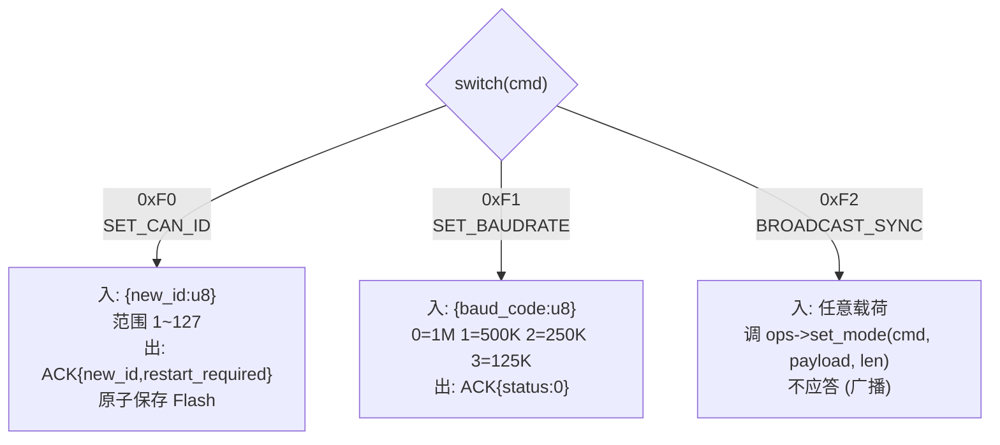
```mermaid
flowchart TB
    SW{"switch(cmd)"}

    SW -->|0xF0<br/>SET_CAN_ID| F1["入: {new_id:u8}<br/>范围 1~127<br/>出: ACK{new_id,restart_required}<br/>原子保存 Flash"]
    SW -->|0xF1<br/>SET_BAUDRATE| F2["入: {baud_code:u8}<br/>0=1M 1=500K 2=250K 3=125K<br/>出: ACK{status:0}"]
    SW -->|0xF2<br/>BROADCAST_SYNC| F3["入: 任意载荷<br/>调 ops->set_mode(cmd, payload, len)<br/>不应答 (广播)"]
```

**0xF0 SET_CAN_ID 流程**：

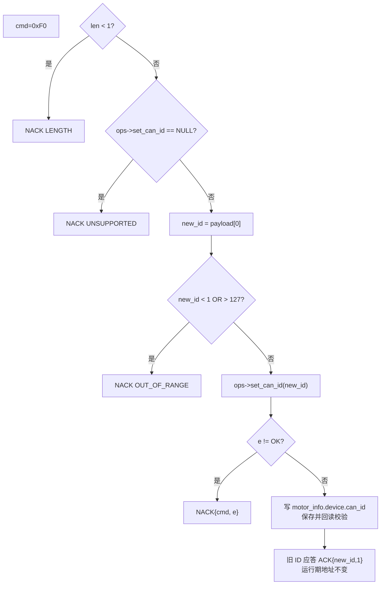
```mermaid
flowchart TB
    S0["cmd=0xF0"]
    L1{"len < 1?"} -->|是| N1["NACK LENGTH"]
    L1 -->|否| L2{"ops->set_can_id == NULL?"} -->|是| N2["NACK UNSUPPORTED"]
    L2 -->|否| P1["new_id = payload[0]"]
    P1 --> L3{"new_id < 1 OR > 127?"} -->|是| N3["NACK OUT_OF_RANGE"]
    L3 -->|否| CALL["ops->set_can_id(new_id)"]
    CALL --> L4{"e != OK?"} -->|是| N4["NACK{cmd, e}"]
    L4 -->|否| SAVE["写 motor_info.device.can_id<br/>保存并回读校验"]
    SAVE --> ACK["旧 ID 应答 ACK{new_id,1}<br/>运行期地址不变"]
```

> CAN 广播仅允许 0xF2 BROADCAST_SYNC 和 0x03 ESTOP，两者均只执行不应答；其他广播命令在 CAN 绑定层直接丢弃。

---

### 4.6 标定查询 0x97

**特殊路径**：不调 `ops->set_mode`，直接读 `calib_mgr_get_status()` 返回 8B 详细状态 ACK。

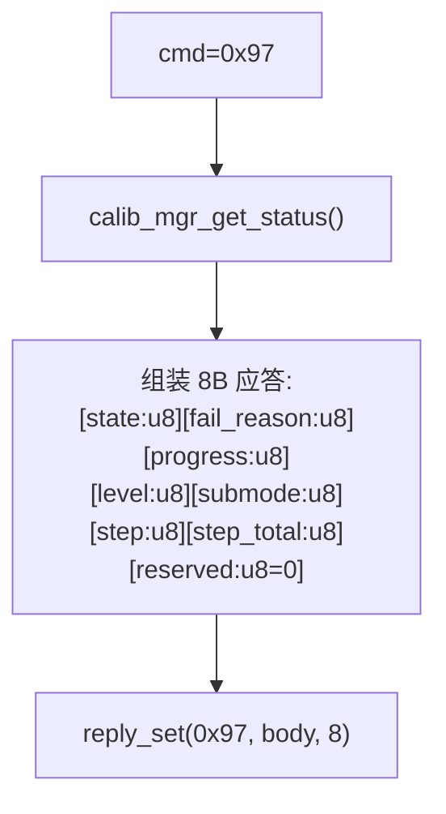
```mermaid
flowchart TB
    S0["cmd=0x97"]
    CALL["calib_mgr_get_status()"]
    PKG["组装 8B 应答:<br/>[state:u8][fail_reason:u8][progress:u8]<br/>[level:u8][submode:u8][step:u8][step_total:u8][reserved:u8=0]"]
    R["reply_set(0x97, body, 8)"]
    S0 --> CALL --> PKG --> R
```

**8B 应答字段**：

| 偏移 | 字段 | 含义 |
|------|------|------|
| 0 | `state` | `calib_state_e`：IDLE/RUNNING/DONE/FAILED |
| 1 | `fail_reason` | `calib_fail_reason_e`：失败原因码（仅 FAILED 时有效） |
| 2 | `progress` | 进度 0~100 |
| 3 | `level` | 当前标定级别 1~7 |
| 4 | `submode` | 当前子模式 |
| 5 | `step` | 当前步骤（L7 全自动用） |
| 6 | `step_total` | L7 总步数（其他 level=0） |
| 7 | reserved | 保留 0 |

> 无论 `state` 为何（空闲/进行/完成/失败）都回 ACK，由上位机解读。

---

### 4.7 控制/校准/诊断 0x00~0xB8

**兜底通用路径**：所有未在前述分支命中的 `cmd <= 0xB8` 命令都走这里。CMD 数值即 `ctrl_mode_e`，由 `ops->set_mode` 解释。

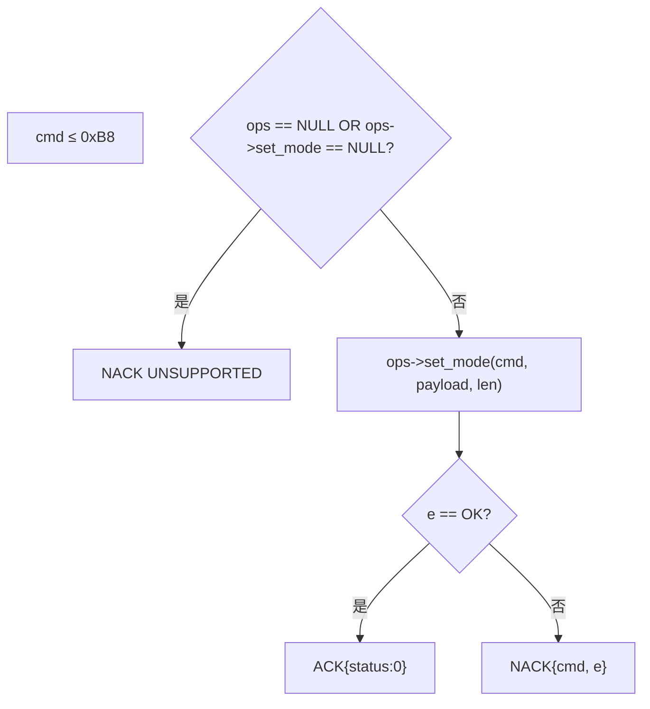
```mermaid
flowchart TB
    S0["cmd ≤ 0xB8"]
    L1{"ops == NULL OR ops->set_mode == NULL?"}
    L1 -->|是| N1["NACK UNSUPPORTED"]
    L1 -->|否| CALL["ops->set_mode(cmd, payload, len)"]
    CALL --> L2{"e == OK?"}
    L2 -->|是| ACK["ACK{status:0}"]
    L2 -->|否| NACK["NACK{cmd, e}"]
```

**`ops->set_mode` 内部分类**（见 [jm_proto_ops.c](../joint_proto/jm_proto_ops.c)）：


```mermaid
flowchart TB
    E["app_set_mode(cmd, payload, len)"]
    SW{"switch(cmd)"}

    SW -->|"0x00~0x06<br/>系统控制"| A1["无载荷，仅切状态<br/>IDLE/HOLD/BRAKE/ESTOP/ENABLE/DISABLE/STOP"]
    SW -->|"0x10 OPEN_LOOP"| A2["{ud:f32, uq:f32}<br/>mc->id=ud, mc->torque=uq"]
    SW -->|"0x11/0x1B<br/>CURRENT/FIELD_WEAKENING"| A3["{id:f32, iq:f32}<br/>mc->id, mc->iq"]
    SW -->|"0x12/0x32/0x37<br/>TORQUE/FORCE/CONSTANT"| A4["{torque:f32}<br/>mc->torque"]
    SW -->|"0x13/0x30<br/>MIT/IMPEDANCE"| A5["{pos,vel,kp,kd,tff} 5×f32=20B<br/>CAN 已解压归一化"]
    SW -->|"0x14/0x1C<br/>VELOCITY/SENSORLESS"| A6["{vel:f32}<br/>mc->vel"]
    SW -->|"0x15 POSITION"| A7["{pos:f32}"]
    SW -->|"0x16 POSITION_VELOCITY"| A8["{pos, vel_ff} 8B"]
    SW -->|"0x17 POSITION_TORQUE"| A9["{pos, tq_lim} 8B"]
    SW -->|"0x18 VELOCITY_TORQUE"| A10["{vel, tq_lim} 8B"]
    SW -->|"0x19 DUTY_CYCLE"| A11["{duty:f32} → mc->torque"]
    SW -->|"0x90~0x96<br/>CALIB_LEVEL1~7"| A12["{submode:u8}<br/>calib_mgr_start(level, submode)<br/>失败: BUSY/STATE_DENY/OUT_OF_RANGE"]
    SW -->|"0x98 CALIB_ABORT"| A13["calib_mgr_abort()<br/>直接返回 OK"]
    SW -->|"其他"| A14["暂仅切状态<br/>载荷由各自 run_*_control 接管"]

    A1 --> TRIG["motor_loop_set_cmd((ctrl_mode_e)cmd)<br/>触发状态机切换"]
    A2 --> TRIG
    A3 --> TRIG
    A4 --> TRIG
    A5 --> TRIG
    A6 --> TRIG
    A7 --> TRIG
    A8 --> TRIG
    A9 --> TRIG
    A10 --> TRIG
    A11 --> TRIG
    A12 --> TRIG
    A13 --> DONE["返回 OK, 不切状态"]
    A14 --> TRIG
```

**标定启动 0x90~0x96 的失败分类**：

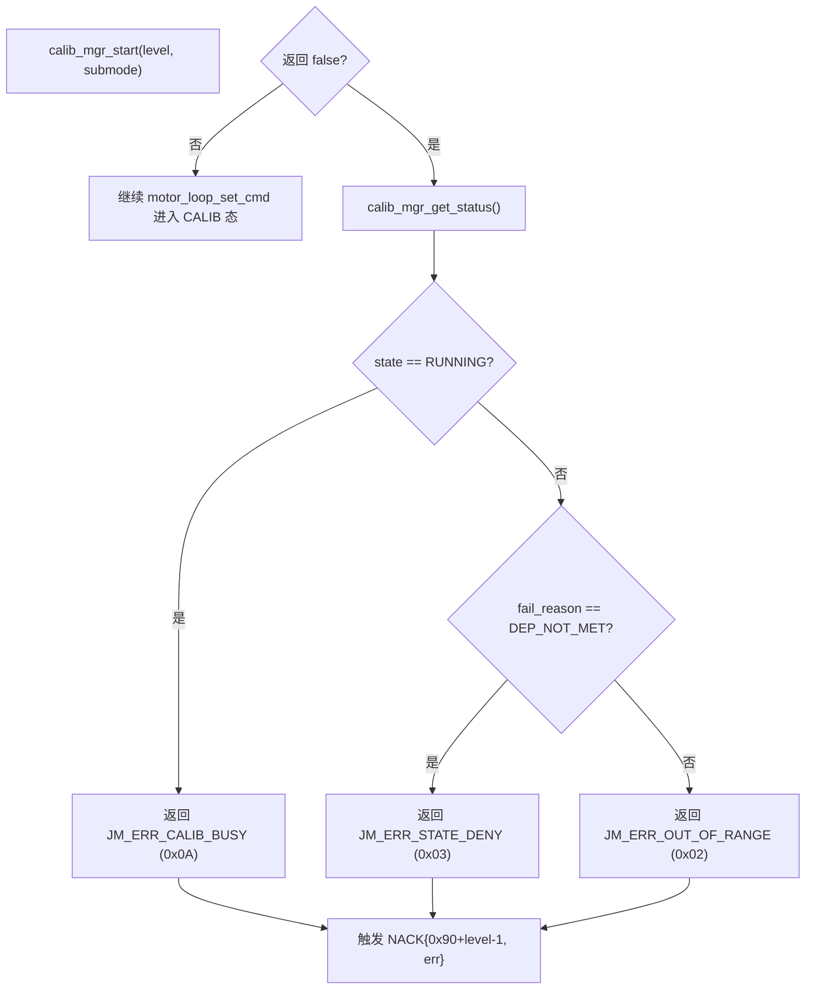
```mermaid
flowchart TB
    S0["calib_mgr_start(level, submode)"]
    L1{"返回 false?"}
    L1 -->|否| OK["继续 motor_loop_set_cmd 进入 CALIB 态"]
    L1 -->|是| Q["calib_mgr_get_status()"]
    Q --> L2{"state == RUNNING?"}
    L2 -->|是| E1["返回 JM_ERR_CALIB_BUSY (0x0A)"]
    L2 -->|否| L3{"fail_reason == DEP_NOT_MET?"}
    L3 -->|是| E2["返回 JM_ERR_STATE_DENY (0x03)"]
    L3 -->|否| E3["返回 JM_ERR_OUT_OF_RANGE (0x02)"]
    E1 --> NACK["触发 NACK{0x90+level-1, err}"]
    E2 --> NACK
    E3 --> NACK
```

---

## 5. 应答组织：ACK / NACK / Reply

`jm_proto.c` 内部三个工具函数负责组织应答：

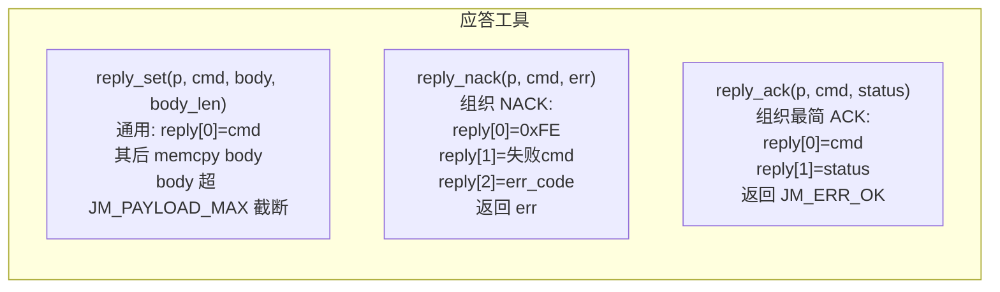
```mermaid
flowchart LR
    subgraph Tools["应答工具"]
        RS["reply_set(p, cmd, body, body_len)<br/>通用: reply[0]=cmd<br/>其后 memcpy body<br/>body 超 JM_PAYLOAD_MAX 截断"]
        RN["reply_nack(p, cmd, err)<br/>组织 NACK:<br/>reply[0]=0xFE<br/>reply[1]=失败cmd<br/>reply[2]=err_code<br/>返回 err"]
        RA["reply_ack(p, cmd, status)<br/>组织最简 ACK:<br/>reply[0]=cmd<br/>reply[1]=status<br/>返回 JM_ERR_OK"]
    end
```

**应答类型对照**：

| 类型 | 应答命令码 | 应答载荷 | 返回值 |
|------|-----------|---------|--------|
| 通用 ACK | 触发命令的 cmd | `{status:u8}` | `JM_ERR_OK` |
| NACK | `0xFE` | `{失败cmd:u8, err_code:u8}` | 失败 err |
| 数据应答 | 触发命令的 cmd | 命令特定（如 0xC0 的 22B 反馈） | `JM_ERR_OK` |
| 无应答 | — | `reply_len = 0` | `JM_ERR_OK`（如 0xF2 广播） |

**NACK 帧格式**：

```
偏移  [0]       [1]          [2]
字段  cmd=0xFE  失败的cmd    err_code
类型  u8        u8           u8 (jm_err_e)
```

**调用约定**：

- `reply_set` 不返回值，调用方自行决定返回什么
- `reply_ack` 恒返回 `JM_ERR_OK`，调用方直接 `return reply_ack(...)`
- `reply_nack` 返回传入的 `err`，调用方直接 `return reply_nack(...)`

---

## 6. 小端编解码助手

`jm_proto.h` 提供 6 个 `static inline` 助手，串口与 CAN 共用：

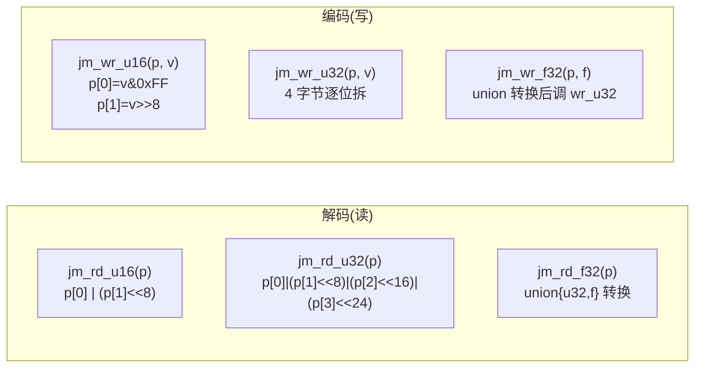
```mermaid
flowchart LR
    subgraph Decode["解码(读)"]
        R16["jm_rd_u16(p)<br/>p[0] | (p[1]<<8)"]
        R32["jm_rd_u32(p)<br/>p[0]|(p[1]<<8)|(p[2]<<16)|(p[3]<<24)"]
        RF32["jm_rd_f32(p)<br/>union{u32,f} 转换"]
    end
    subgraph Encode["编码(写)"]
        W16["jm_wr_u16(p, v)<br/>p[0]=v&0xFF<br/>p[1]=v>>8"]
        W32["jm_wr_u32(p, v)<br/>4 字节逐位拆"]
        WF32["jm_wr_f32(p, f)<br/>union 转换后调 wr_u32"]
    end
```

**使用约定**：

- 所有多字节字段**统一小端**编码（与 Cortex-M 内存序一致）
- 浮点统一 IEEE-754 `f32`
- 助手均为 `static inline`，无函数调用开销，可在中断上下文安全使用

---

## 7. 典型命令端到端解析实例

### 7.1 0x15 POSITION 命令（UART）

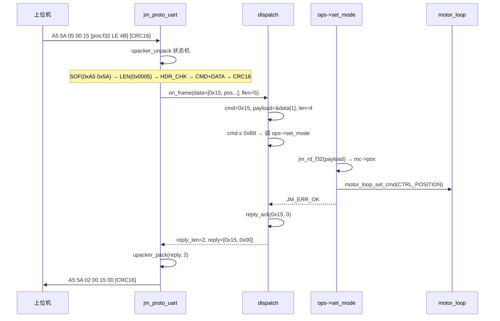
```mermaid
sequenceDiagram
    participant U as 上位机
    participant UART as jm_proto_uart
    participant DISP as dispatch
    participant OPS as ops->set_mode
    participant ML as motor_loop

    U->>UART: A5 5A 05 00 15 [pos:f32 LE 4B] [CRC16]
    UART->>UART: upacker_unpack 状态机
    Note over UART: SOF(0xA5 0x5A) → LEN(0x0005) → HDR_CHK → CMD+DATA → CRC16
    UART->>DISP: on_frame(data=[0x15, pos...], flen=5)
    DISP->>DISP: cmd=0x15, payload=&data[1], len=4
    DISP->>DISP: cmd ≤ 0xB8 → 调 ops->set_mode
    OPS->>OPS: jm_rd_f32(payload) → mc->pos
    OPS->>ML: motor_loop_set_cmd(CTRL_POSITION)
    OPS-->>DISP: JM_ERR_OK
    DISP->>DISP: reply_ack(0x15, 0)
    DISP-->>UART: reply_len=2, reply=[0x15, 0x00]
    UART->>UART: upacker_pack(reply, 2)
    UART->>U: A5 5A 02 00 15 00 [CRC16]
```

### 7.2 0x13 MIT 命令（CAN）

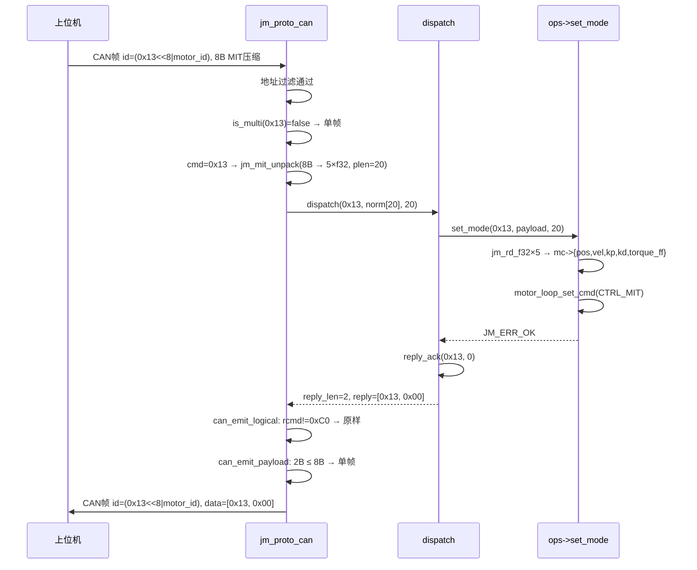
```mermaid
sequenceDiagram
    participant U as 上位机
    participant CAN as jm_proto_can
    participant DISP as dispatch
    participant OPS as ops->set_mode

    U->>CAN: CAN帧 id=(0x13<<8|motor_id), 8B MIT压缩
    CAN->>CAN: 地址过滤通过
    CAN->>CAN: is_multi(0x13)=false → 单帧
    CAN->>CAN: cmd=0x13 → jm_mit_unpack(8B → 5×f32, plen=20)
    CAN->>DISP: dispatch(0x13, norm[20], 20)
    DISP->>OPS: set_mode(0x13, payload, 20)
    OPS->>OPS: jm_rd_f32×5 → mc->{pos,vel,kp,kd,torque_ff}
    OPS->>OPS: motor_loop_set_cmd(CTRL_MIT)
    OPS-->>DISP: JM_ERR_OK
    DISP->>DISP: reply_ack(0x13, 0)
    DISP-->>CAN: reply_len=2, reply=[0x13, 0x00]
    CAN->>CAN: can_emit_logical: rcmd!=0xC0 → 原样
    CAN->>CAN: can_emit_payload: 2B ≤ 8B → 单帧
    CAN->>U: CAN帧 id=(0x13<<8|motor_id), data=[0x13, 0x00]
```

> **归一化关键**：CAN 把 8B 压缩 MIT 解成 5×f32 后再 dispatch，`ops->set_mode` 看到的载荷与 UART 完全一致，**应用层对传输介质无感**。

### 7.3 0xE2 PARAM_READ_BULK（CAN 多帧）

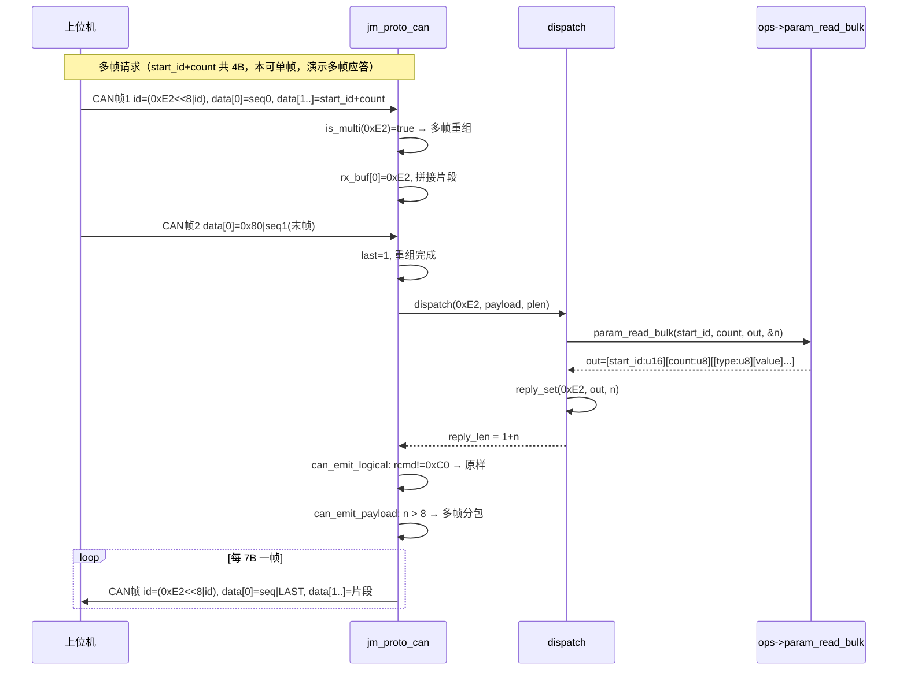
```mermaid
sequenceDiagram
    participant U as 上位机
    participant CAN as jm_proto_can
    participant DISP as dispatch
    participant OPS as ops->param_read_bulk

    Note over U,CAN: 多帧请求（start_id+count 共 4B，本可单帧，演示多帧应答）
    U->>CAN: CAN帧1 id=(0xE2<<8|id), data[0]=seq0, data[1..]=start_id+count
    CAN->>CAN: is_multi(0xE2)=true → 多帧重组
    CAN->>CAN: rx_buf[0]=0xE2, 拼接片段
    U->>CAN: CAN帧2 data[0]=0x80|seq1(末帧)
    CAN->>CAN: last=1, 重组完成
    CAN->>DISP: dispatch(0xE2, payload, plen)
    DISP->>OPS: param_read_bulk(start_id, count, out, &n)
    OPS-->>DISP: out=[start_id:u16][count:u8][[type:u8][value]...]
    DISP->>DISP: reply_set(0xE2, out, n)
    DISP-->>CAN: reply_len = 1+n
    CAN->>CAN: can_emit_logical: rcmd!=0xC0 → 原样
    CAN->>CAN: can_emit_payload: n > 8 → 多帧分包
    loop 每 7B 一帧
        CAN->>U: CAN帧 id=(0xE2<<8|id), data[0]=seq|LAST, data[1..]=片段
    end
```

---

## 8. UART 与 CAN 解析差异

| 维度 | UART (jm_proto_uart) | CAN (jm_proto_can) |
|------|---------------------|-------------------|
| **dispatch 前的预处理** | 仅 upacker_unpack 拆出 cmd+payload | 地址过滤 + 单/多帧判定 + MIT 解压归一化 |
| **MIT 命令载荷** | 5×f32 = 20B 原样 | 8B 压缩 → 解压为 5×f32 再 dispatch |
| **0xC0 反馈应答** | 直接用 dispatch 写入的 22B 全精度 reply | 重新调 `get_feedback` + `jm_fb_pack` 压 8B |
| **大载荷命令** | 单帧无限制（≤JM_PAYLOAD_MAX=256B） | >8B 自动多帧分包（7B/帧+控制字） |
| **广播处理** | 不适用（点对点链路） | 仅 SYNC/ESTOP，执行但不应答 |
| **dispatch 看到的载荷** | 原样 | MIT 已归一化，其余原样 |

**CAN 0xC0 反馈应答的特殊处理**：

```mermaid
flowchart LR
    D["dispatch 完成"]
    R["reply_len > 0, rcmd=0xC0"]
    CHK{"rcmd == 0xC0<br/>且 ops->get_feedback != NULL?"}
    CHK -->|"是"| REPACK["重新 get_feedback(&fb)<br/>jm_fb_pack(packed, &fb) → 8B<br/>can_emit_payload(packed, 8)"]
    CHK -->|"否"| RAW["can_emit_payload(reply_body, reply_len-1)"]
```

> 设计原因：CAN 上对 0xC0 反馈应答**不使用** dispatch 写入的全精度 22B，而是重新压缩为 8B 定点，与达妙/CubeMars 习惯一致。

---

## 9. 错误码与失败定位

`jm_err_e`（NACK 的 err_code 字段）：

| 值 | 宏 | 含义 | 典型触发场景 |
|----|-----|------|--------------|
| 0x00 | `JM_ERR_OK` | 成功 | 正常应答，不发 NACK |
| 0x01 | `JM_ERR_UNSUPPORTED` | CMD 不支持 | ops 回调为 NULL，或 cmd 不在已知范围 |
| 0x02 | `JM_ERR_OUT_OF_RANGE` | 参数越界 | CAN_ID 不在 1~127、baud_code > 3、标定 submode 越界 |
| 0x03 | `JM_ERR_STATE_DENY` | 状态不允许 | 标定前置依赖未完成、proto 为 NULL |
| 0x04 | `JM_ERR_BAD_PARAM_ID` | param_id 无效 | 参数表查不到对应字段 |
| 0x05 | `JM_ERR_CRC` | 校验错误 | UART CRC16 失败（由 packer_parser 处理，不进 dispatch） |
| 0x06 | `JM_ERR_LENGTH` | 长度错误 | 载荷字节数少于该 cmd 要求的最小长度 |
| 0x07 | `JM_ERR_READ_ONLY` | 只读参数不可写 | 写 motor_param 的 RO 字段 |
| 0x08 | `JM_ERR_FLASH` | Flash 读写失败 | param_save / motor_info_save 落 Flash 失败 |
| 0x09 | `JM_ERR_FAULT_STATE` | 故障态需先清障 | 故障未清除时下发控制命令 |
| 0x0A | `JM_ERR_CALIB_BUSY` | 校准未完成/校准中 | 标定进行中再次启动标定 |

**失败定位流程**：

```mermaid
flowchart TB
    NACK["收到 NACK 帧<br/>[0xFE][失败cmd][err_code]"]
    CMD["按 失败cmd 定位到具体命令"]
    ERR{"err_code?"}

    ERR -->|0x01 UNSUPPORTED| L1["检查 ops 回调是否注入<br/>检查 cmd 是否在已知范围"]
    ERR -->|0x02 OUT_OF_RANGE| L2["检查载荷值范围<br/>(CAN_ID 1~127, baud 0~3, submode)"]
    ERR -->|0x03 STATE_DENY| L3["检查标定前置依赖<br/>(done_mask 位图)<br/>检查 proto 实例是否有效"]
    ERR -->|0x04 BAD_PARAM_ID| L4["检查 param_id 是否在 CSV 表内<br/>(0~MOTOR_PARAM_PARAM_COUNT-1)"]
    ERR -->|0x06 LENGTH| L5["检查载荷字节数<br/>(CSV 标注的最小长度)"]
    ERR -->|0x07 READ_ONLY| L6["检查字段是否为 RO<br/>(CSV 第 8 列)"]
    ERR -->|0x08 FLASH| L7["检查 Flash 驱动<br/>(jm_app_param_storage_save 强符号)"]
    ERR -->|0x09 FAULT_STATE| L8["先发 0xB0 CLEAR_FAULT 清障"]
    ERR -->|0x0A CALIB_BUSY| L9["等标定完成或发 0x98 中止"]
```

---

## 附：文件清单与职责

| 文件 | 职责 |
|------|------|
| [jm_cmd_def.h](../joint_proto/jm_cmd_def.h) | 命令码枚举 / 错误码 / 类型码 / CAN-ID 宏 / MIT 范围 / 遥测位掩码 |
| [jm_proto.h](../joint_proto/jm_proto.h) / [.c](../joint_proto/jm_proto.c) | 传输无关的 dispatch 核心 + 应答组织 + 小端编解码助手 + `jm_proto_ops_t` 回调接口 |
| [jm_proto_uart.h](../joint_proto/jm_proto_uart.h) / [.c](../joint_proto/jm_proto_uart.c) | 串口绑定层：用 packer_parser 组拆帧，调 dispatch 后封帧发回 |
| [jm_proto_can.h](../joint_proto/jm_proto_can.h) / [.c](../joint_proto/jm_proto_can.c) | CAN 绑定层：MIT 定点压缩 + 多帧分包 + 地址过滤 |
| [jm_proto_ops.h](../joint_proto/jm_proto_ops.h) / [.c](../joint_proto/jm_proto_ops.c) | 业务回调实现（对接 motor_loop / runtime_param / motor_param / version / calib_mgr） |
| [example_jm_proto_uart.c](../joint_proto/example_jm_proto_uart.c) | 串口接入示例（不参与编译，仅参考） |
