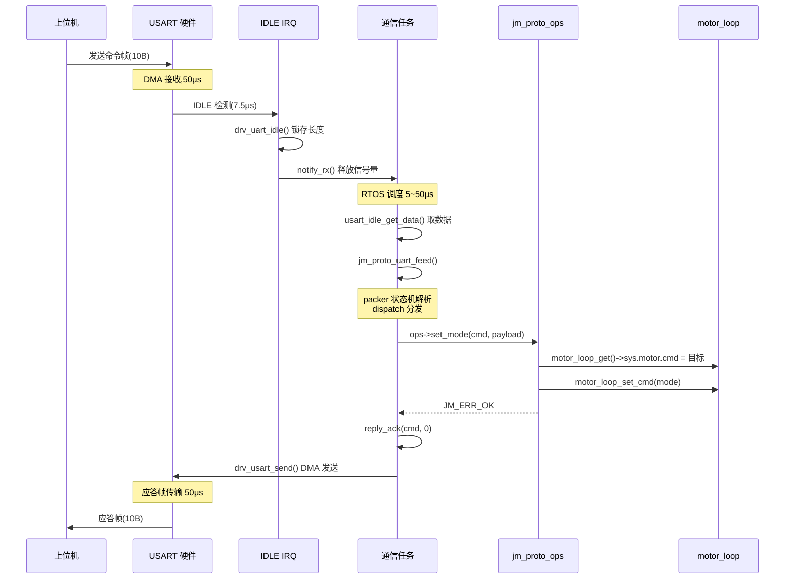
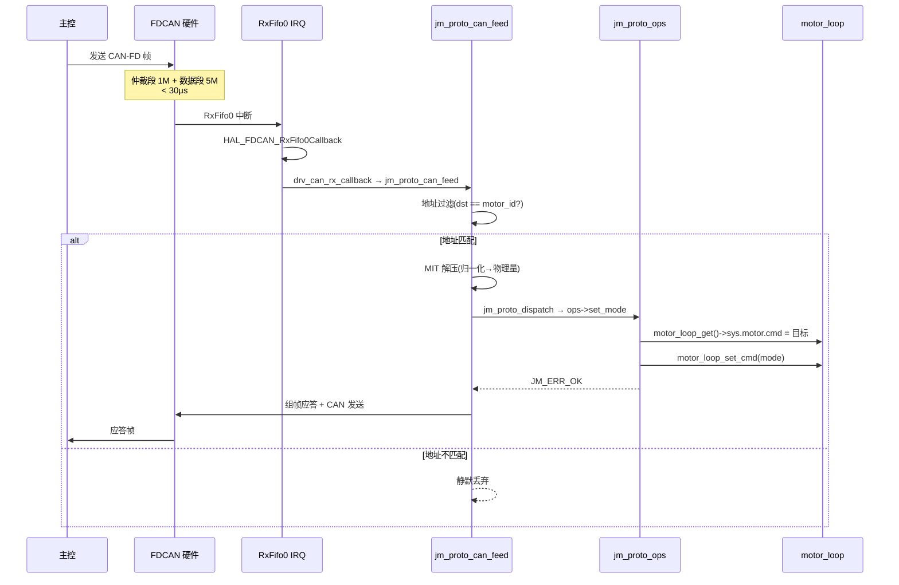

# joint_proto 通讯实时性评估

> 本文档基于 `joint_proto` 协议栈实际代码实现,量化评估 UART(2Mbps) 与 CAN-FD(5Mbps) 两条通信路径的命令-应答延迟。
>
> **相关文档**:
> - [joint_proto_layer_diagram.md](joint_proto_layer_diagram.md):协议四层架构总览
> - [joint_proto_文件逻辑关系图.md](joint_proto_文件逻辑关系图.md):跨文件调用关系
> - [joint_proto_解析流程说明.md](joint_proto_解析流程说明.md):命令分发详解
>
> **硬件配置**:STM32G4 + USART DMA + FDCAN,RTOS 任务调度
> **波特率**:UART 2Mbps / CAN-FD 仲裁段 1Mbps + 数据段 5Mbps

---

## 目录

- [1. 总体结论](#1-总体结论)
- [2. UART 路径实时性评估](#2-uart-路径实时性评估)
  - [2.1 数据通路架构](#21-数据通路架构)
  - [2.2 延迟分解表](#22-延迟分解表)
  - [2.3 时序图](#23-时序图)
  - [2.4 关键代码位置](#24-关键代码位置)
- [3. CAN 路径实时性评估](#3-can-路径实时性评估)
  - [3.1 数据通路架构](#31-数据通路架构)
  - [3.2 延迟分解表](#32-延迟分解表)
  - [3.3 时序图](#33-时序图)
  - [3.4 关键代码位置](#34-关键代码位置)
- [4. UART vs CAN 对比](#4-uart-vs-can-对比)
- [5. 与控制环周期的匹配度](#5-与控制环周期的匹配度)
- [6. 潜在瓶颈分析](#6-潜在瓶颈分析)
- [7. 优化建议](#7-优化建议)

---

## 1. 总体结论

| 路径 | 典型延迟 | 最坏延迟 | 执行上下文 | 适用场景 |
|------|---------|---------|-----------|---------|
| **UART 2Mbps** | **150~250 μs** | ≈ 500 μs(被高优先级抢占) | 通信任务 | 调试/上位机/参数配置 |
| **CAN-FD 5M** | **80~120 μs** | ≈ 200 μs(ISR 内执行) | CAN RX 中断 | 实时控制总线 |

两条路径**均不占用控制环时间**:控制目标经 `sys.motor.cmd` 无锁交接,电流环 ISR 独立运行,通信延迟仅影响"命令下发到生效"的时延。

---

## 2. UART 路径实时性评估

### 2.1 数据通路架构

UART 采用**中断触发 + 任务解析**的混合模式:

```
┌─────────────────────────────────────────────────┐
│ ISR 上下文(快速、最少操作)                      │
│  1. USART IDLE IRQ 硬件触发                     │
│  2. drv_uart_idle(): 停 DMA + 锁存帧长度        │
│  3. jm_host_commun_notify_rx(): 释放信号量      │
│  → ISR 返回(不做协议解析)                       │
└─────────────────────────────────────────────────┘
                     ↓ 信号量唤醒
┌─────────────────────────────────────────────────┐
│ 任务上下文(jm_host_commun_process)              │
│  4. dev.poll() → usart_idle_get_data() 取锁存数据│
│  5. jm_proto_uart_feed() → dispatch → ops 回调   │
│  6. 应答封帧 → drv_usart_send()                  │
└─────────────────────────────────────────────────┘
```

**设计要点**:
- **中断触发,非周期轮询**:IDLE IRQ 直接释放信号量,任务立即被调度,不等满 1ms 周期
- **解析放任务上下文**:回调可自由调用任何 API(motor_param/motor_info/Flash),无 ISR 阻塞约束
- **信号量机制与 1ms 周期解耦**:有数据即唤醒,响应延迟与线程周期无关

### 2.2 延迟分解表

以 10B 命令帧 + 10B 应答帧为例:

| 阶段 | 耗时 | 上下文 | 说明 |
|------|------|--------|------|
| 命令帧传输(10B @2M) | **50 μs** | 硬件 DMA | 10字节 × 10bit / 2Mbps |
| IDLE 检测(1.5 字符) | 7.5 μs | 硬件 | USART 硬件自动检测 |
| IDLE IRQ + 停 DMA + 释放信号量 | < 10 μs | ISR | [stm32g4xx_it.c:289](../Board/V1/Core/Src/stm32g4xx_it.c#L289) |
| RTOS 信号量唤醒 + 上下文切换 | 5~50 μs | RTOS | 取决于优先级抢占 |
| `usart_idle_get_data` + `feed` + dispatch | 20~80 μs | 任务 | 协议解析 + ops 回调 |
| 应答封帧 + DMA 启动 | < 10 μs | 任务 | `upacker_pack` → `drv_usart_send` |
| 应答帧传输(10B @2M) | **50 μs** | 硬件 DMA | |
| **典型总延迟** | **≈ 150~250 μs** | | |
| **最坏值**(被高优先级抢占) | **≈ 500 μs** | | |

**256B 最大帧情况**:

| 阶段 | 耗时 |
|------|------|
| 命令帧传输(256B @2M) | 1.28 ms |
| 应答帧传输(256B @2M) | 1.28 ms |
| **典型总延迟(256B)** | **≈ 2.7~3.0 ms** |

### 2.3 时序图



### 2.4 关键代码位置

| 函数 | 文件 | 作用 |
|------|------|------|
| `USART_IDLE_IRQHandler` | [stm32g4xx_it.c:287](../Board/V1/Core/Src/stm32g4xx_it.c#L287) | IDLE 中断入口 |
| `jm_host_commun_notify_rx` | [jm_host_commun.c:184](../AppServices/ParamService/jm_host_commun.c#L184) | 释放 RX 信号量 |
| `jm_host_commun_wait` | [jm_host_commun.c:193](../AppServices/ParamService/jm_host_commun.c#L193) | 信号量等待(非轮询) |
| `jm_host_commun_process` | [jm_host_commun.c](../AppServices/ParamService/jm_host_commun.c) | 任务上下文协议处理 |
| `dev_commun_uart_poll` | [dev_commun_uart.c](../Devices/dev_commun_uart.c) | 取 DMA 数据 + feed |
| `jm_proto_uart_feed` | [jm_proto_uart.c](../Protocol/joint_proto/jm_proto_uart.c) | 喂字节到 packer |
| `jm_proto_dispatch` | [jm_proto.c](../Protocol/joint_proto/jm_proto.c) | 命令分发核心 |
| `drv_usart_send` | [drv_usart.c](../Driver/drv_usart.c) | DMA 发送(超时 20ms) |

---

## 3. CAN 路径实时性评估

### 3.1 数据通路架构

CAN 采用**ISR 内直接 dispatch**的极低延迟模式:

```
┌─────────────────────────────────────────────────┐
│ ISR 上下文(全程在中断中执行)                    │
│  1. FDCAN RxFifo0 IRQ 硬件触发                  │
│  2. HAL_FDCAN_RxFifo0Callback() 回调            │
│  3. drv_can_rx_callback() 取帧 + 转换格式       │
│  4. jm_proto_can_feed() 地址过滤 + dispatch      │
│  5. ops 回调执行(写 motor.cmd)                  │
│  6. 应答帧组帧 + CAN 发送                       │
│  → ISR 返回                                     │
└─────────────────────────────────────────────────┘
```

**设计要点**:
- **全程 ISR 执行**:无任务调度开销,延迟最低
- **地址过滤在 ISR 内**:不匹配的帧静默丢弃,不占用总线
- **严格非阻塞约束**:所有 ops 回调必须非阻塞(禁 Flash/禁打印/禁分配)

### 3.2 延迟分解表

以 CAN-FD 帧(仲裁段 1Mbps + 数据段 5Mbps,64B 数据帧)为例:

| 阶段 | 耗时 | 上下文 | 说明 |
|------|------|--------|------|
| 命令帧接收(仲裁+数据段) | **< 30 μs** | 硬件 | CAN-FD 帧含 47bit 仲裁段 + 数据段 |
| `HAL_FDCAN_RxFifo0Callback` | < 5 μs | ISR | [drv_can.c:274](../Driver/drv_can.c#L274) |
| 地址过滤 + MIT 解压 | < 5 μs | ISR | [jm_proto_can.c:232](../Protocol/joint_proto/jm_proto_can.c#L232) |
| dispatch + ops 回调 | 10~50 μs | ISR | **在 ISR 中直接执行** |
| 应答帧组帧 + 发送 | < 30 μs | ISR | CAN-FD 帧发送 |
| **典型总延迟** | **≈ 80~120 μs** | | |
| **最坏值**(CAN 总线仲裁) | **≈ 200 μs** | | 多节点竞争时 |

### 3.3 时序图



### 3.4 关键代码位置

| 函数 | 文件 | 作用 |
|------|------|------|
| `HAL_FDCAN_RxFifo0Callback` | [drv_can.c:274](../Driver/drv_can.c#L274) | FDCAN RX 回调入口 |
| `drv_can_rx_callback` | [drv_can.c](../Driver/drv_can.c) | 取帧 + 格式转换 |
| `jm_proto_can_feed` | [jm_proto_can.c:232](../Protocol/joint_proto/jm_proto_can.c#L232) | 地址过滤 + dispatch |
| `jm_proto_dispatch` | [jm_proto.c](../Protocol/joint_proto/jm_proto.c) | 命令分发核心(与 UART 共用) |

---

## 4. UART vs CAN 对比

| 维度 | UART(2Mbps) | CAN-FD(5Mbps) |
|------|-------------|---------------|
| **执行上下文** | 通信任务 | **CAN RX 中断** |
| **典型延迟** | 150~250 μs | **80~120 μs** |
| **最坏延迟** | ≈ 500 μs | ≈ 200 μs |
| **调度开销** | RTOS 信号量唤醒 + 上下文切换 | **无**(ISR 内完成) |
| **回调限制** | 无(可调 Flash/打印/分配) | **严格非阻塞** |
| **地址过滤** | 无(点对点) | ISR 内过滤(总线多节点) |
| **错误恢复** | 帧头重同步 + CRC16 | CAN 硬件 ACK + 重发 |
| **最坏帧传输** | 256B → 1.28 ms | 64B 数据段 → ~100 μs |
| **适用场景** | 调试/上位机/参数配置 | 实时控制总线 |

**核心差异**:UART 选择"中断触发 + 任务解析"以换取回调自由度;CAN 选择"ISR 内直接 dispatch"以换取最低延迟。

---

## 5. 与控制环周期的匹配度

假设典型关节电机控制环频率:

| 控制环 | 周期 | UART 250μs 占比 | CAN 100μs 占比 | 评价 |
|--------|------|----------------|----------------|------|
| 电流环 20kHz | 50 μs | 500% | 200% | 都不能用通信帧打断 |
| 速度环 2kHz | 500 μs | 50% | 20% | CAN 可用,UART 边缘 |
| 位置环 1kHz | 1 ms | 25% | 10% | 都可用 |
| 位置环 500Hz | 2 ms | 12.5% | 5% | 充裕 |

**关键点**:通信响应**不影响控制环**。控制目标经 `sys.motor.cmd` 无锁交接(单生产者单消费者),电流环 ISR 独立运行,通信延迟仅影响"命令下发到生效"的时延,不占用电流环时间。

---

## 6. 潜在瓶颈分析

### 6.1 UART 路径瓶颈

**1. `drv_usart_send` 阻塞发送,超时 20ms**

```c
// dev_commun_uart.c
#define JM_UART_TX_TIMEOUT_MS 20u
```

- 同步等待 DMA 完成,期间线程阻塞
- 2M 波特率下 256B 帧仅需 1.28ms,20ms 超时是**保险阀值**
- 风险:若 DMA 通道冲突或总线错误,会阻塞线程 20ms

**2. packer 单全局 `send_buffer`**

```c
// packer_parser.c
static uint8_t send_buffer[SEND_BUF_SIZE];
```

- 每拍只能发一帧,**无发送忙查询**
- 遥测帧(0xCA)与应答帧若同拍触发会互相抢占

**3. 反馈读取非原子**

`app_get_feedback` 从 `usr.motor_state[M1]` 读 16+ 个字段,跨字段可能读到电流环 ISR 半更新快照。单字段 float 读取是原子的,但整套数据非严格一致。

### 6.2 CAN 路径瓶颈

**1. ISR 内回调执行时间**

`jm_proto_dispatch` 在 ISR 中执行,若回调耗时过长(如复杂的参数查表),会延长 ISR 占用时间,影响其他高优先级中断。

**2. CAN 总线仲裁延迟**

多节点同时发送时,低优先级节点需等待仲裁完成,最坏延迟取决于总线负载。

---
